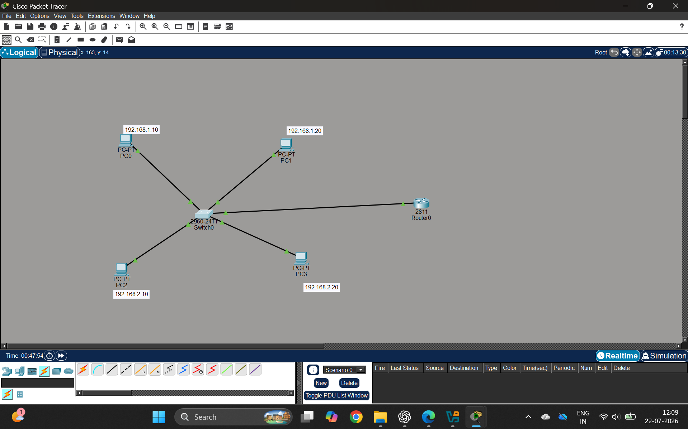
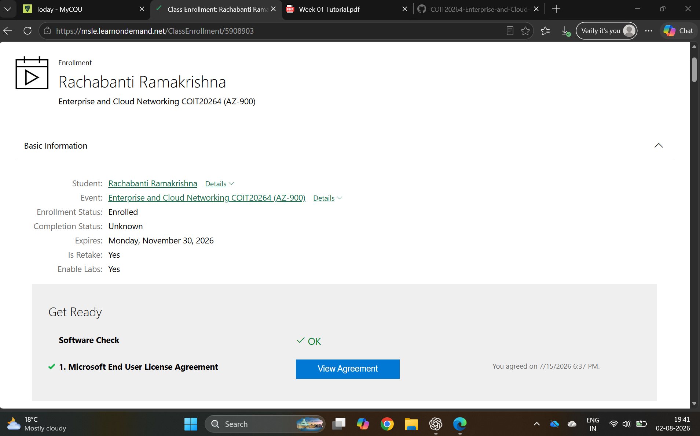

# week 1
## Introduction to Cloud Computing and Microsoft Azure

## Overview
This week introduced the fundamentals of cloud computing and Microsoft Azure. The practical activities included setting up Cisco Packet Tracer, creating a Microsoft Azure student account, registering for the Microsoft Learn training course using the provided training key, and exploring Azure cloud service models.

## Portfolio Tasks

## Task 1 – Cisco Packet Tracer Home Network

### Description
I installed and registered Cisco Packet Tracer and created a basic home network. The network was designed with a router, a switch, and four PCs connected using Ethernet cables. Each PC was configured with a unique IP address to simulate communication within a local area network (LAN).

### Network Components
- 1 × Router (Cisco 2811)
- 1 × Switch (Cisco 2960-24TT)
- 4 × PCs
 ### IP Address Configuration

```
  PC0
    IP Address: 192.168.1.10
    Subnet Mask: 255.255.255.0
    Default Gateway: 192.168.1.1

  PC1
    IP Address: 192.168.1.20
    Subnet Mask: 255.255.255.0
    Default Gateway: 192.168.1.1

  PC2
    IP Address: 192.168.2.10
    Subnet Mask: 255.255.255.0
    Default Gateway: 192.168.2.1

  PC3
    IP Address: 192.168.2.20
    Subnet Mask: 255.255.255.0
    Default Gateway: 192.168.2.1
``` 
- Ethernet cables
- IP addressing configuration

### Skills Demonstrated
- Cisco Packet Tracer installation and registration
- Basic network topology design
- Device connectivity
- IP address configuration
- Local Area Network (LAN) simulation

### Task 1 Screenshot



## Task 2 – Microsoft Azure Registration

### Objective
Create a Microsoft Azure student account using the CQUniversity email and register for the Microsoft Learn course using the provided training key.

### Steps Completed
- Created a Microsoft Azure student account using my CQUniversity email.
- Registered for the Microsoft Learn training course using the provided training key.
- Successfully enrolled in the **Enterprise and Cloud Networking COIT20264 (AZ-900)** course.
- Verified registration through the Microsoft Learn **View Agreement** page.

### Screenshot



### Outcome
Successfully completed the Microsoft Learn course registration and verified enrollment through the View Agreement page.

## Task 3 – Microsoft Azure Service Models

### Objective
I Explore Microsoft Azure services available in the Azure Portal and identify three examples of each cloud service model.

### Infrastructure as a Service (IaaS)
- Azure Virtual Machines
- Azure Virtual Network
- Azure Load Balancer

### Platform as a Service (PaaS)
- Azure App Service
- Azure SQL Database
- Azure Functions

### Software as a Service (SaaS)
- Microsoft 365
- Microsoft Teams
- Microsoft OneDrive

## Learning Outcomes
- Understood the fundamentals of cloud computing.
- Gained practical experience with Cisco Packet Tracer.
- Successfully created a Microsoft Azure account and registered for Microsoft Learn using the provided training key.
- Explored Microsoft Azure services and cloud deployment models.
