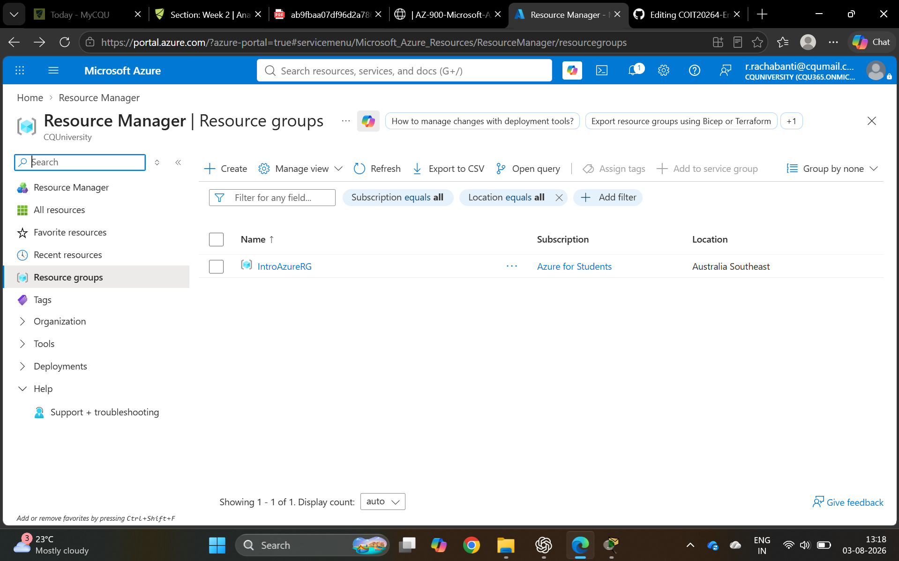
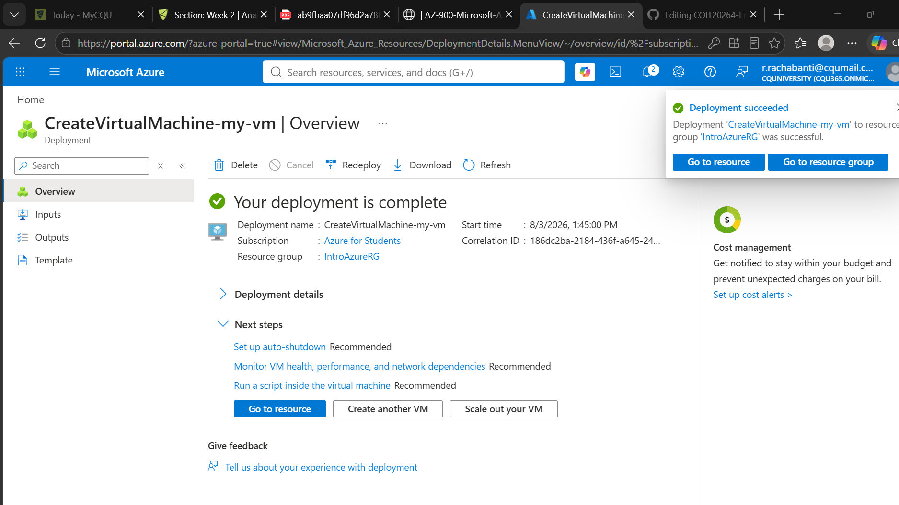
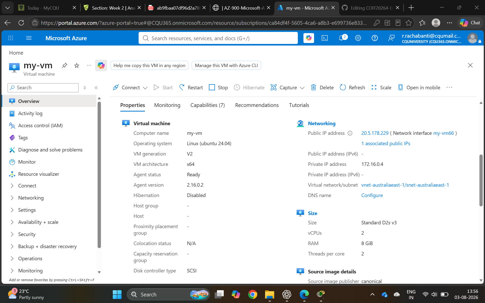

# week02
## Azure Virtual Machine and Cloud Shell

## Overview

This week focused on creating and managing an Azure Virtual Machine using the Microsoft Azure Portal and Azure Cloud Shell. The practical activities included deploying a virtual machine, configuring it through the Bash Cloud Shell, installing a web server, and understanding the concept and functions of virtual machines.

## Portfolio Tasks

## Task 1 – Build an Azure Virtual Machine (GUI Method)

### Objective
To create a Microsoft Azure Virtual Machine using the Azure Portal graphical user interface (GUI).

### Description
In this task, I successfully created a Virtual Machine using the Microsoft Azure Portal. I configured the required resource group, virtual machine settings, and deployment options by following the provided Microsoft Learn lab instructions. After the deployment was completed, I verified that the virtual machine was successfully created and recorded the required information.

### Virtual Machine Details

### Virtual Machine Details

- **Subscription:** Azure for Students
- **Resource Group:** IntroAzureRG
- **Virtual Machine Name:** my-vm
- **Operating System:** Ubuntu Server 24.04 LTS
- **VM Architecture:** x64
- **Region:** Australia East
- **Virtual Machine Size:** Standard D2s v3 (2 vCPUs, 8 GiB Memory)
- **Authentication Type:** Password
- **Username:** azureuser
- **Public IP Address:** 20.5.178.229
- **Private IP Address:** 10.0.0.4
- **Virtual Network:** my-vm-vnet

### Skills Demonstrated

- Microsoft Azure Portal
- Resource Group Creation
- Virtual Machine Deployment
- Azure Resource Management
- Cloud Infrastructure (IaaS)

### Screenshots

### Outcome

Successfully created and deployed an Azure Virtual Machine using the Azure Portal and verified its deployment by recording the virtual machine details, including the public IP address and subscription information.

## Task 2 – Create a Virtual Machine

### Objective
To create a Microsoft Azure Virtual Machine using the Azure Portal.

### Description
I successfully created an Azure Virtual Machine using the Microsoft Azure Portal. The virtual machine was deployed within the **IntroAzureRG** resource group by following the Microsoft Learn tutorial. After deployment, I verified that the VM was created successfully and recorded its configuration details.

### Virtual Machine Details

- **Virtual Machine Name:** my-vm
- **Resource Group:** IntroAzureRG
- **Operating System:** Ubuntu Server 24.04 LTS
- **VM Architecture:** x64
- **VM Size:** Standard D2s v3
- **Public IP Address:** 20.5.178.229
- **Agent Status:** Ready

### Screenshot

### Outcome
Successfully deployed and verified an Azure Virtual Machine using the Microsoft Azure Portal.
