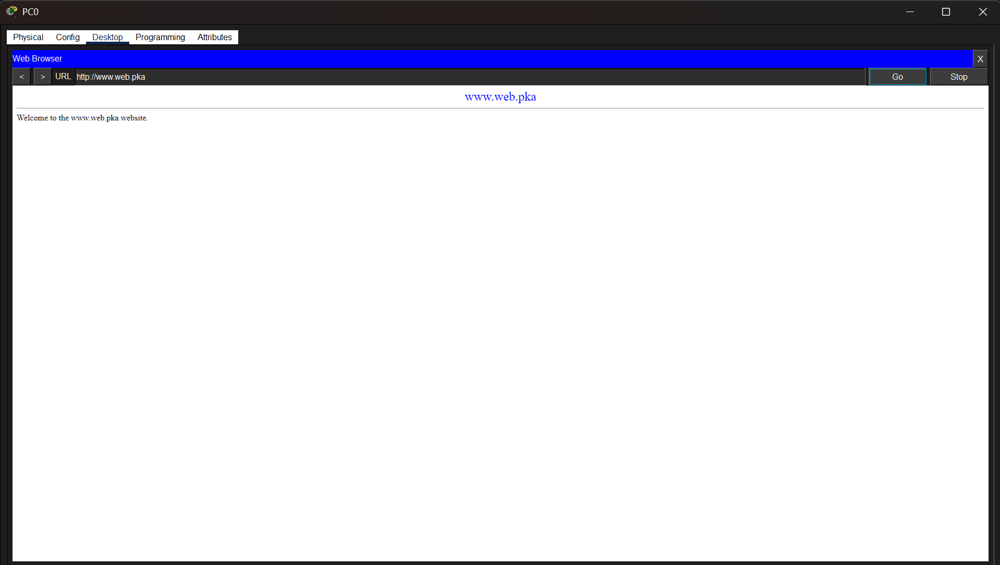
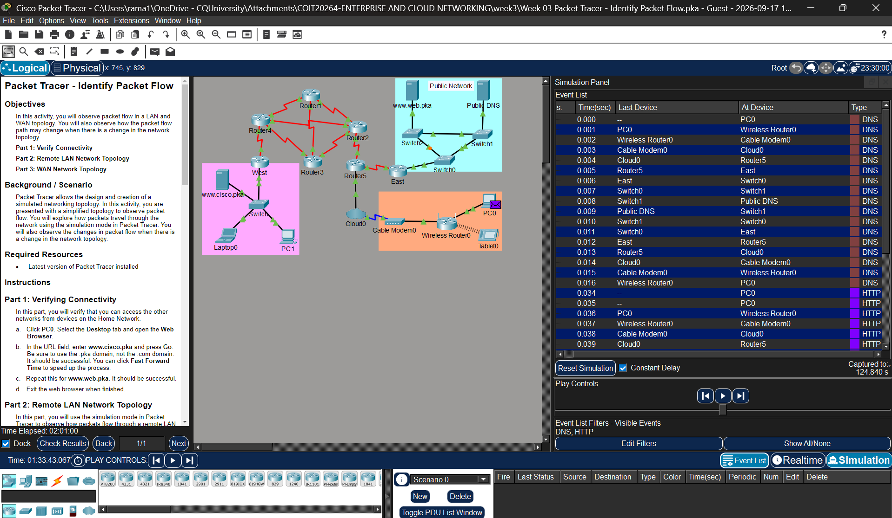
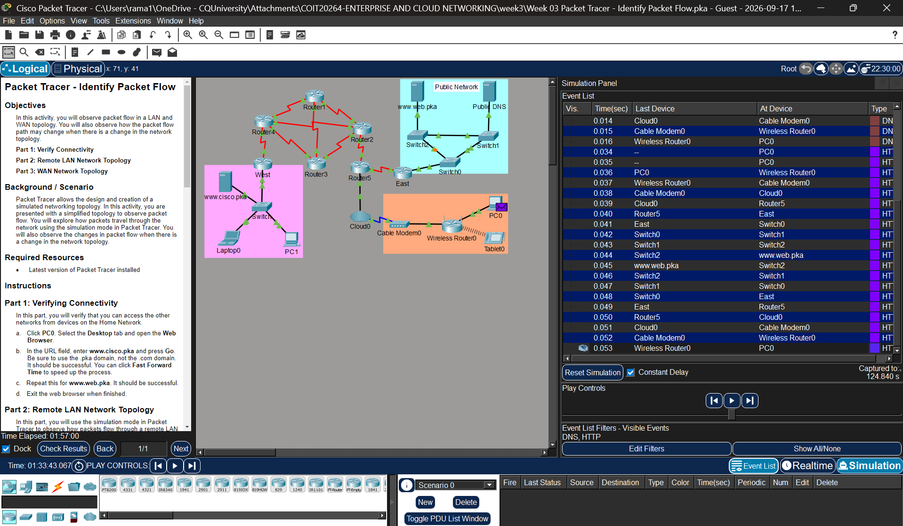
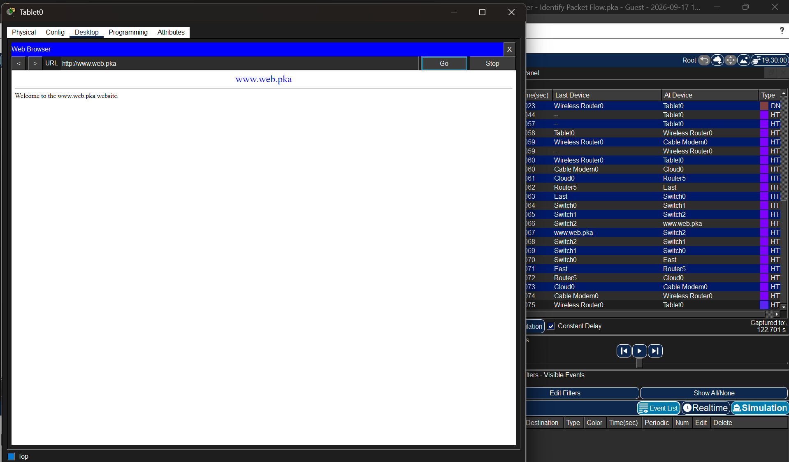
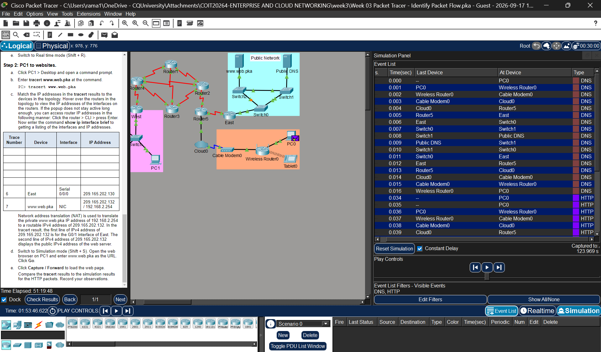
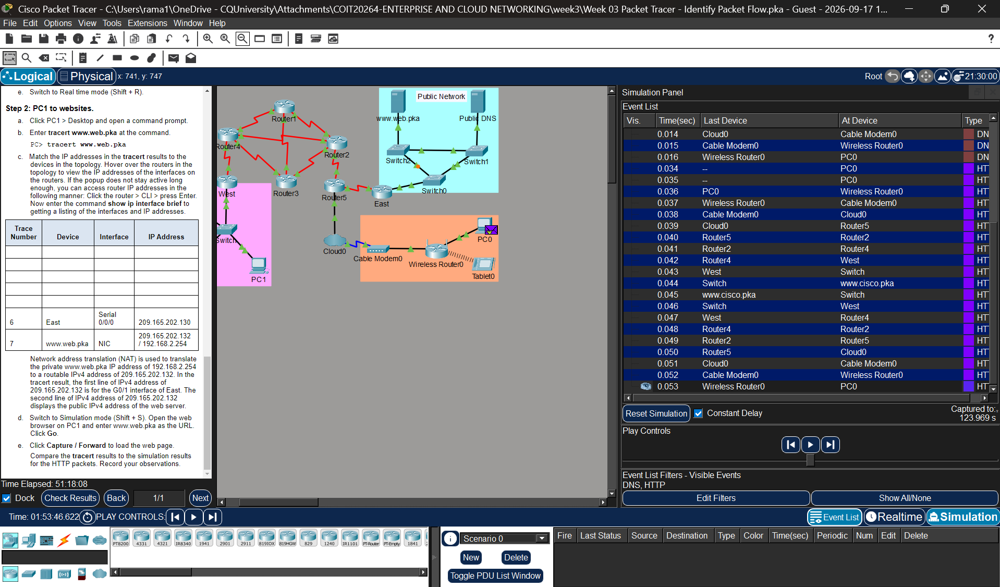
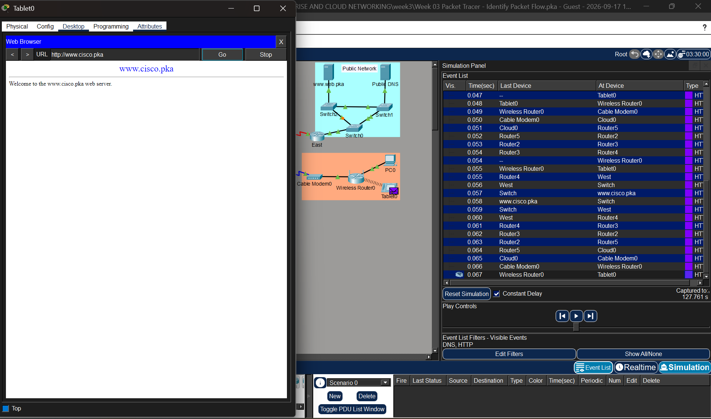
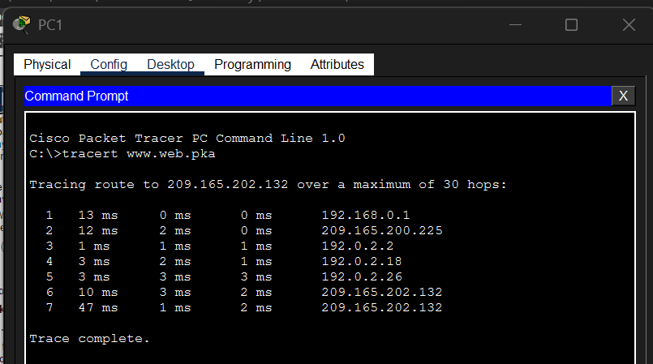
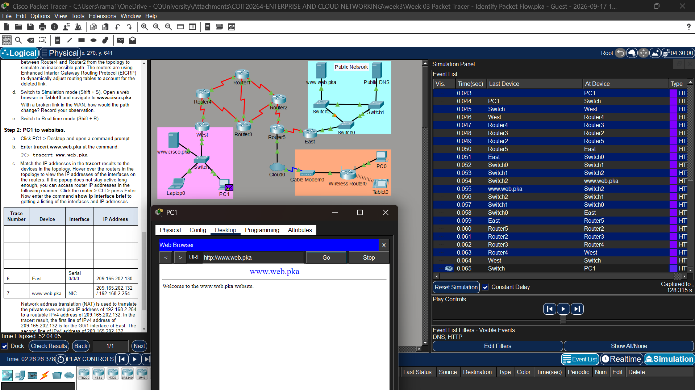

# Week 3 – Identify Packet Flow

## Overview

- I learned how packets travel in LAN and WAN networks.
- I used Simulation mode to check the DNS and HTTP packet flow.
- I removed some network links and checked how the packet path changed.
- I used `tracert` to check the path from one device to another.
- I compared the `tracert` results with the HTTP packet flow in Packet Tracer.

---

## Task 1 – Verify Connectivity

I first tested connectivity from PC0 using the Web Browser.

I accessed:

- `www.cisco.pka`
- `www.web.pka`

Both websites loaded successfully, confirming that PC0 could communicate with the remote networks.

### Evidence

*Figure 1: Successful access to the web server from the Home Network.*

---

## Task 2 – Remote LAN Network Topology

### DNS Packet Path Prediction

Before forwarding the packets in Simulation mode, I predicted that PC0 would send the DNS request through the Home Network and then across the network to the Public DNS server.

After observing the simulation, the DNS request travelled through:

**PC0 → Wireless Router0 → Cable Modem0 → Cloud0 → Router5 → East → Switch0 → Switch1 → Public DNS**

The DNS response then travelled back towards PC0.

### Evidence

*Figure 2: DNS packet flow observed in Simulation mode.*

### HTTP Packet Path

After the IP address of `www.web.pka` was resolved, I observed the HTTP packets in Simulation mode.

The HTTP packets travelled through:

**PC0 → Wireless Router0 → Cable Modem0 → Cloud0 → Router5 → East → Switch0 → Switch1 → Switch2 → www.web.pka**

The response packets travelled back through the network to PC0.

### Evidence

*Figure 3: HTTP packet flow observed in Simulation mode.*

### Broken LAN Link

I switched to Realtime mode and removed the link between **Switch0 and Switch1** in the Public Network. After allowing the network to adjust, I accessed `www.web.pka` from Tablet0 in Simulation mode.

The webpage was still accessible because another path was available.

The observed path used:

**Switch0 → Switch2 → www.web.pka**

instead of using the broken Switch0–Switch1 link.

This showed that the LAN had another available path when one link became unavailable.

### Evidence

*Figure 4: Alternative packet path after removing the link between Switch0 and Switch1.*

---

## Task 3 – WAN Network Topology

### PC0 to www.cisco.pka

I used Simulation mode to observe communication between PC0 and `www.cisco.pka`.

### DNS Packet Path Prediction

I predicted that the DNS request would travel from PC0 through the Home Network and WAN to the Public DNS server so that the IP address of `www.cisco.pka` could be resolved.

The DNS request travelled through the network to the Public DNS server, and the DNS response returned to PC0.

### Evidence

*Figure 5: DNS packet flow while resolving www.cisco.pka.*

### HTTP Packet Path

After DNS resolution, I observed the HTTP packets travelling towards `www.cisco.pka`.

Before the WAN link was removed, the main WAN path observed was:

**PC0 → Wireless Router0 → Cable Modem0 → Cloud0 → Router5 → Router2 → Router4 → West → Switch → www.cisco.pka**

The response packets travelled back towards PC0.

### Evidence

*Figure 6: HTTP packet flow from PC0 to www.cisco.pka across the WAN.*

### Broken WAN Link

I switched to Realtime mode and removed the link between **Router4 and Router2**.

The routers were using EIGRP, so the routing path adjusted after the direct connection became unavailable.

I then accessed `www.cisco.pka` from Tablet0 in Simulation mode.

The alternative WAN path observed was:

**Tablet0 → Wireless Router0 → Cable Modem0 → Cloud0 → Router5 → Router2 → Router3 → Router4 → West → Switch → www.cisco.pka**

The packets used **Router3** as an alternative route between Router2 and Router4.

This showed how dynamic routing can redirect traffic when a WAN link becomes unavailable.

### Evidence

*Figure 7: Alternative WAN packet path after removing the Router4–Router2 link.*

---

## Task 4 – PC1 to www.web.pka

### Traceroute

From PC1, I opened Command Prompt and ran:

`tracert www.web.pka`

The traceroute showed the Layer 3 hops between PC1 and the destination. I matched the traceroute addresses with the devices and interfaces in the Packet Tracer topology.

| Trace Number | Device | Interface | IP Address |
|---:|---|---|---|
| 1 | West | GigabitEthernet0/1 | `192.168.0.1` |
| 2 | Router4 | Serial0/1/1 | `209.165.200.225` |
| 3 | Router3 | Serial0/0/0 | `192.0.2.2` |
| 4 | Router2 | Serial0/0/1 | `192.0.2.18` |
| 5 | Router5 | Serial0/1/1 | `192.0.2.26` |
| 6 | East / NAT | — | `209.165.202.132` |
| 7 | www.web.pka | NIC | `209.165.202.132` |

The repeated `209.165.202.132` addresses are related to the NAT configuration used to provide access to the web server, whose private address is `192.168.2.254`.

### Evidence

*Figure 8: Traceroute from PC1 to www.web.pka showing the Layer 3 hops.*

### Network Address Translation (NAT)

The activity uses NAT for the `www.web.pka` server.

The server has the private IP address:

`192.168.2.254`

and it is represented externally using the routable address:

`209.165.202.132`

This allows the private web server to be accessed across the network using a routable IPv4 address.

### Comparing Tracert and HTTP Simulation

I then opened `www.web.pka` from PC1 in Simulation mode and followed the HTTP packets using Capture/Forward.

The main HTTP path observed was:

**PC1 → Switch → West → Router4 → Router3 → Router2 → Router5 → East → Switch0 → Switch1 → Switch2 → www.web.pka**

The `tracert` results and HTTP simulation showed the same main Layer 3 route through:

**West → Router4 → Router3 → Router2 → Router5 → East**

The difference was that Packet Tracer Simulation mode also showed the switches and other devices used to forward the HTTP packets, while `tracert` mainly showed the Layer 3 hops between PC1 and the destination.

### Evidence

*Figure 9: HTTP packet path from PC1 to www.web.pka in Simulation mode.*

---

## Reflection

- This activity helped me understand more clearly how packet flow works in LAN and WAN networks and how data travels from a source device to a destination.
- By using Simulation mode, I was able to follow the packets step by step instead of only seeing the final result.
- I observed that DNS communication happens before HTTP communication because the website name first needs to be resolved to an IP address.
- I was able to see how packets travel through different network devices such as switches and routers before reaching the destination server.
- By removing the link between Switch0 and Switch1, I learned that the LAN could still use another available path to reach the web server.
- I also removed the link between Router4 and Router2 and observed how EIGRP selected an alternative route through Router3, allowing the communication to continue.
- This helped me understand why having alternative paths and dynamic routing is useful when a network link becomes unavailable.
- Using `tracert` helped me identify the Layer 3 hops between PC1 and the web server and understand which routers were involved in the path.
- Finally, comparing the `tracert` results with Simulation mode helped me understand that `tracert` mainly shows the Layer 3 hops, while Packet Tracer Simulation provides more detail about how packets move through the network.

## Problems Faced and How I Overcame Them

- At first, I found it a little difficult to follow the DNS and HTTP packets because there were many packets showing in Simulation mode. I selected only DNS and HTTP in the filters and used Capture/Forward to check the packets one by one.

- While checking the packet flow, the simulation buffer became full. I used the previous events option and continued the simulation more slowly so I could follow the packets properly.

- After removing the connection between Switch0 and Switch1, I was not sure which path the packets would take. I tested the website again from Tablet0 and saw that the packets were able to reach the web server using Switch2.

- I had a similar problem after removing the connection between Router4 and Router2. I followed the packets again in Simulation mode and found that the traffic was going through Router3 instead. This helped me understand how EIGRP can find another route when a connection is down.

- When I used `tracert`, it showed IP addresses instead of the router names. I checked the IP addresses on the routers and matched them with the traceroute results to understand which devices the packets were passing through.
