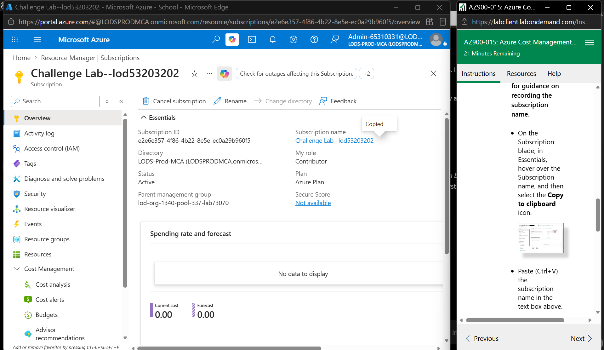
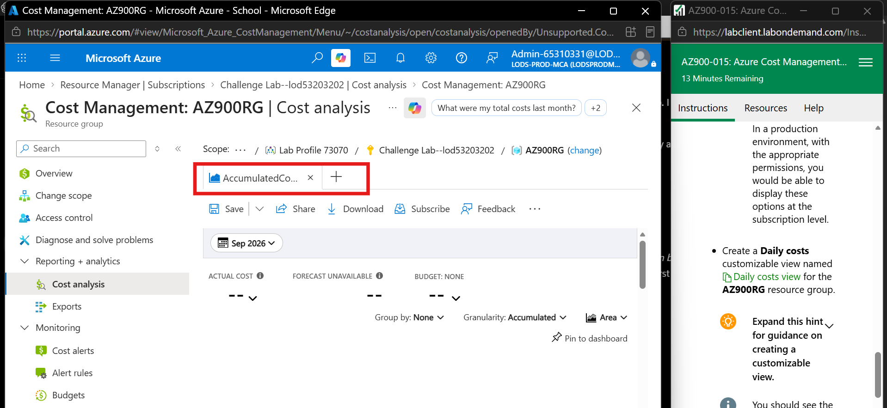
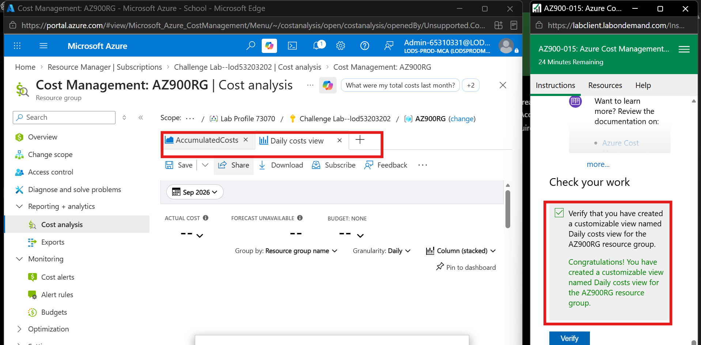
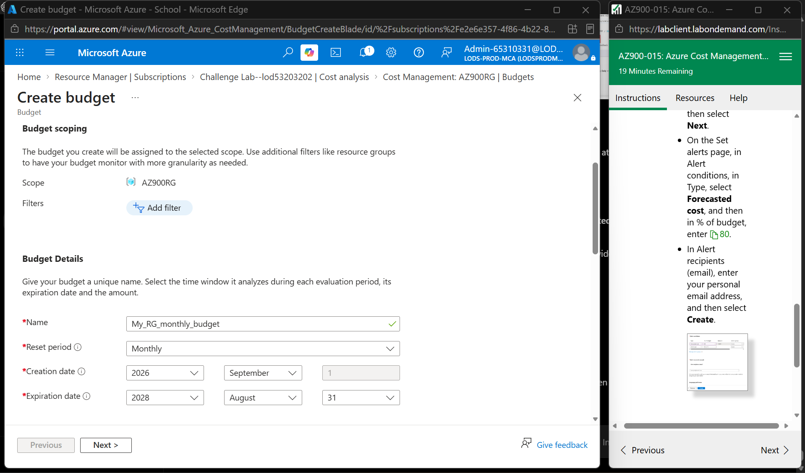
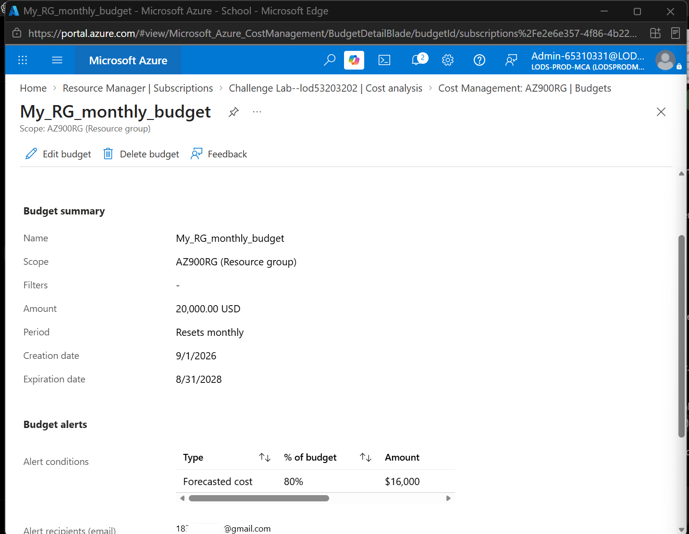
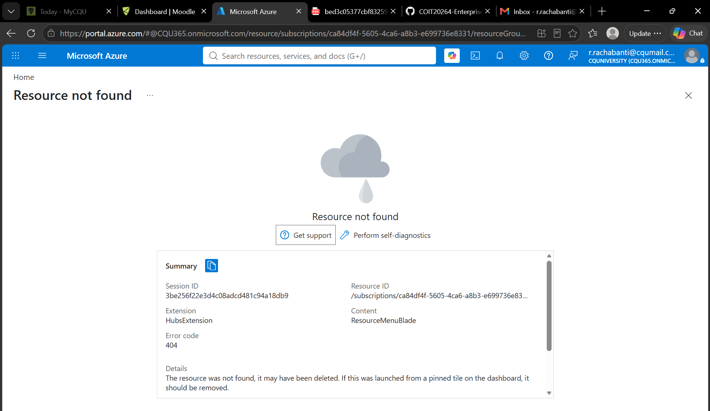

# Week 4 – Azure Cost Management

## Overview

In this week's activity, I worked with Azure Cost Management in the Azure portal. I learned how to view cost information for a resource group, create a customized cost view, and create a monthly budget with a forecast alert.

The main activities I completed were:

- Viewed the Azure subscription used for the lab.
- Changed the Cost Analysis scope to the `AZ900RG` resource group.
- Reviewed the Cost Analysis page.
- Created a customized Daily costs view.
- Created a monthly budget for the resource group.
- Configured a forecasted cost alert at 80% of the budget.
- Added an email address to receive budget alerts.

---

## Task 1 – Review the Azure Subscription

I opened the **Subscriptions** page in the Azure portal and selected the subscription provided for the lab.

The subscription used during the activity was:

`Challenge Lab--lod53203202`

From the subscription page, I could view information such as the subscription ID, status, role and current cost.

### Evidence

*Figure 1: Azure subscription used for the Cost Management activity.*

---

## Task 1.2 – Review Cost Analysis

I opened **Cost Management > Cost analysis** and changed the scope to the `AZ900RG` resource group.

This allowed me to review cost information specifically for the resources inside this resource group instead of looking at the whole subscription.

The **AccumulatedCosts** view was available on the Cost Analysis page.

Because this was a temporary lab environment, there was no meaningful accumulated cost data available.

### Evidence

*Figure 2: Cost Analysis page for the AZ900RG resource group.*

---

## Task 1.3 – Create a Daily Costs View

From the Cost Analysis page, I added a new customizable view and selected **Daily costs**.

I saved the view with the name:

`Daily costs view`

The new view appeared as a separate tab next to the AccumulatedCosts view.

The lab verification also confirmed that the Daily costs view was created successfully for the `AZ900RG` resource group.

### Evidence

*Figure 3: Daily costs view successfully created for the AZ900RG resource group.*

---

## Task 1.4 – Create a Monthly Budget

I then used the **Budgets** option in Azure Cost Management to create a budget for the `AZ900RG` resource group.

The budget was configured with the following settings:

| Setting | Value |
|---|---|
| Budget name | `My_RG_monthly_budget` |
| Scope | `AZ900RG` |
| Reset period | Monthly |
| Budget amount | `$20,000 USD` |
| Alert type | Forecasted cost |
| Alert threshold | `80%` |
| Alert amount | `$16,000` |

The monthly reset period means Azure evaluates the budget again for each monthly period.

### Evidence

*Figure 4: Configuration of the monthly budget for the AZ900RG resource group.*

---

## Task 1.5 – Configure the Budget Alert

For the budget alert, I selected **Forecasted cost** and configured the alert threshold to:

`80%`

Since the total monthly budget was `$20,000`, the 80% alert represented:

`$16,000`

I also added an email address as the alert recipient.

This means an alert can be sent when Azure forecasts that the configured budget threshold will be reached.

### Evidence

*Figure 5: My_RG_monthly_budget showing the monthly budget and 80% forecasted cost alert.*

---
## Portfolio Task 2 – Azure Blob Storage

### Creating the Storage Account

For this task, I created an Azure Storage Account using my Azure for Students subscription.

The storage account was created with the following settings:

- **Resource Group:** `IntroAzureRG`
- **Storage Account:** `cloudshell37176613`
- **Region:** Australia East
- **Primary Service:** Azure Blob Storage or Azure Data Lake Storage
- **Performance:** Standard
- **Redundancy:** Locally-redundant storage (LRS)
- **Account Type:** StorageV2

The storage account was successfully deployed and ready to use.

### Evidence

*Figure 6: Successfully created Azure Storage Account.*

---

### Creating a Storage Container and Uploading a File

Inside the storage account, I created a container named:

`mystoragecontainer`

I then uploaded the following test file into the container:

`mycontainertest.txt`

The file was successfully uploaded and displayed inside the container as a **Block blob**.

### Evidence

*Figure 7: Storage container showing the successfully uploaded mycontainertest.txt file.*

---

### Cloud Storage Blob Concept and Functions

A cloud storage blob is used to store unstructured data in the cloud. This can include text files, documents, images, videos, backups and other types of files.

Azure Blob Storage uses the following structure:

`Storage Account → Container → Blob`

In this activity, the structure was:

`cloudshell37176613 → mystoragecontainer → mycontainertest.txt`

The storage account provides the main storage resource, the container is used to organise the stored data, and the uploaded file is stored as a blob.

Azure Blob Storage can be used to:

- Store files and unstructured data in the cloud.
- Organise data using containers.
- Upload and download files.
- Store documents, images, videos and backups.
- Control access to stored data.
- Provide scalable cloud storage.
- Use redundancy options to improve data availability.

---

### Clean-Up

After completing the activity and saving the required screenshots, I deleted the `IntroAzureRG` resource group.

This removed the resources created for the activity and helped prevent unnecessary use of my Azure student credits.

After refreshing the page, Azure displayed **Resource not found**, confirming that the resource group had been deleted.

### Evidence

*Figure 8: Azure showing Resource not found after deleting the IntroAzureRG resource group.*

---

## What I Learned

This activity helped me understand how Azure Cost Management can be used to monitor cloud spending.

I learned that the scope can be changed so that costs can be viewed for a particular resource group. I also learned how customizable views can make it easier to check costs in different ways, such as viewing daily costs.

Creating the budget helped me understand that a budget does not stop resources from running when the amount is reached. Instead, it can be used to monitor spending and provide alerts when configured thresholds are reached.

The forecast alert was also useful because it can provide a warning based on expected spending before the full budget amount is reached.

---

## Problems Faced and How I Solved Them

While creating the budget, I initially had a problem when adding the alert recipient email address. Azure showed an error saying that an alert threshold percentage was required.

At first, it looked like there was a problem with the email address, but the actual issue was that the alert condition had not been fully configured.

I went back to the alert conditions and selected **Forecasted cost** with an **80%** threshold. After completing the alert condition, I was able to add the email recipient and save the budget successfully.

This helped me understand that Azure validates the complete alert configuration before allowing the budget to be created.

---

## Reflection

- This week's activities helped me understand both Azure Cost Management and Azure Blob Storage.

- I learned that cloud management is not only about creating and configuring resources, but also about monitoring and controlling their costs.

- Creating the Daily costs view helped me understand how Azure costs can be monitored over time.

- Creating a budget and forecast alert showed me how administrators can track spending and receive an early warning when costs are expected to reach a certain level.

- In the Blob Storage activity, I learned how to create a storage account, create a container and upload a file as a blob.

- I also understood the relationship between a storage account, container and blob, and how they are used to organise and store data in Azure.

- Finally, I learned the importance of cleaning up Azure resources after completing the activities so that unused resources do not continue consuming student credits.

- Overall, Week 4 gave me a better understanding of Azure cost management, budgeting, cost alerts and cloud storage.
