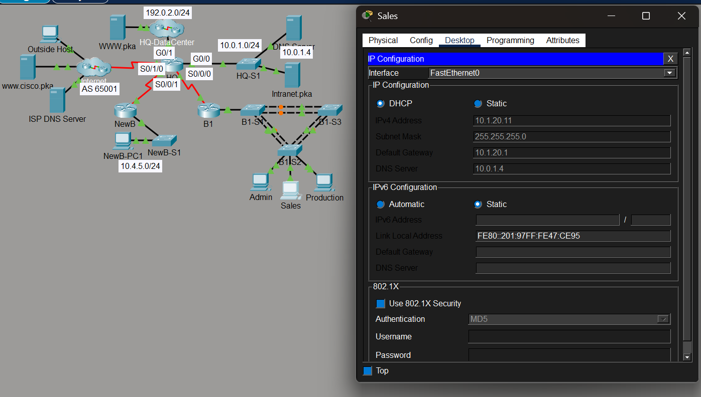
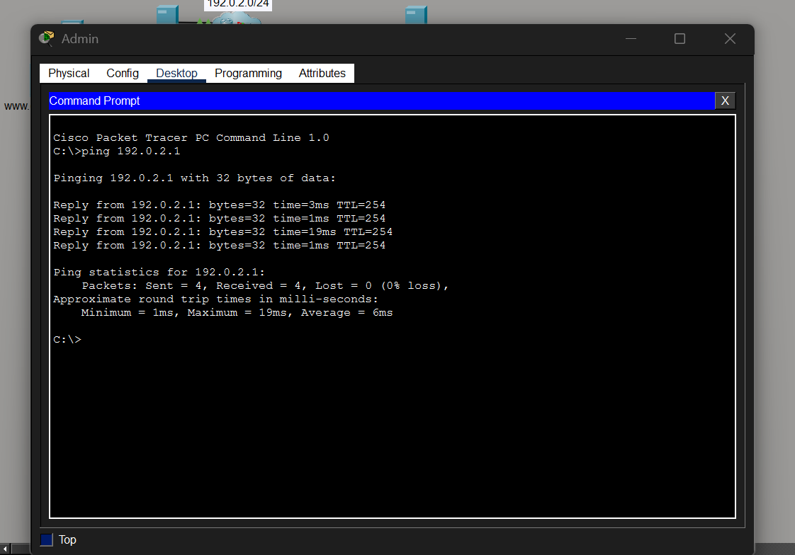
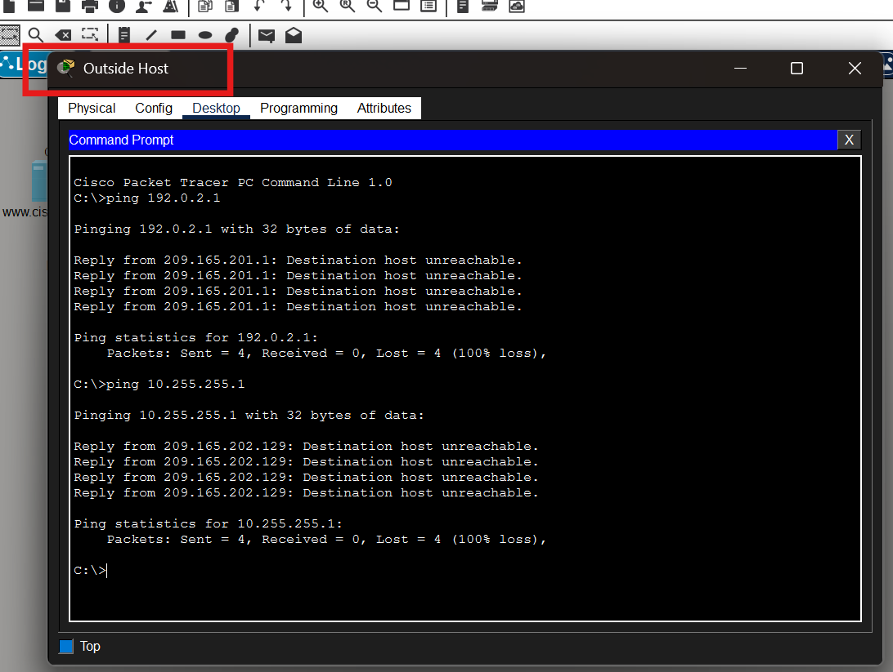
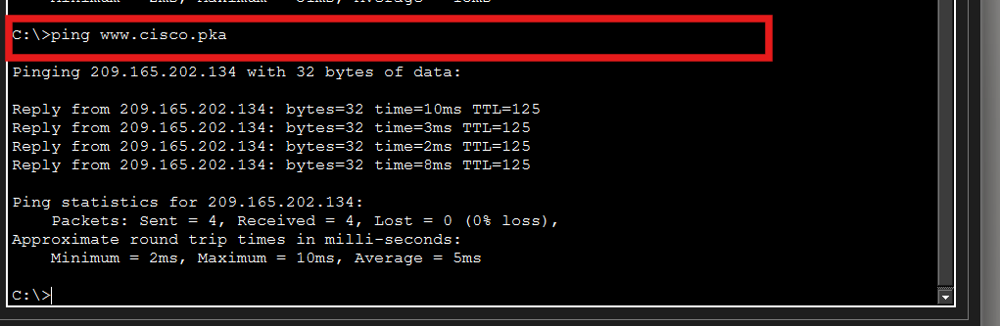
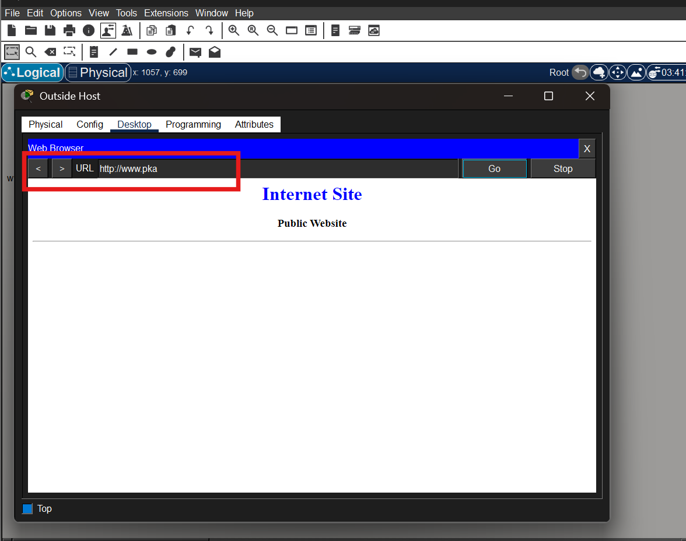
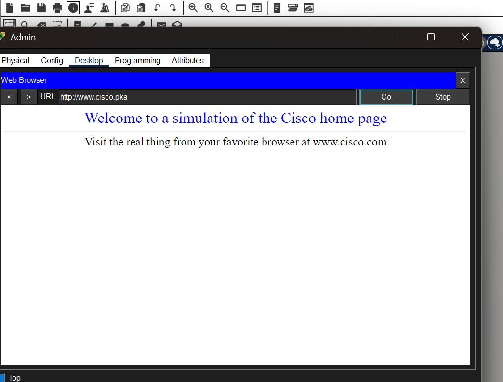

# Week 5 – Packet Tracer Network Topology Design Practice

## Overview

In Week 5, I worked on a Packet Tracer network for XYZ Corporation. The activity included WAN connections, routing, VLANs, NAT, DHCP and network security configurations.

The main configurations completed in this activity were:

- PPP with CHAP and PAP authentication
- eBGP
- Dynamic NAT and PAT
- Inter-VLAN routing
- Static and default routing
- EIGRP
- VLANs and trunking
- Port security
- SSH
- DHCP
- Access Control List (ACL)
- Connectivity and HTTP testing

---

## Network Configuration

### PPP and eBGP

I configured PPP on the HQ WAN connections. The connection between HQ and the Internet used CHAP authentication, while the connection between HQ and NewB used PAP authentication.

I also configured eBGP between HQ and the Internet. HQ used AS 65000 and the Internet router used AS 65001. The `192.0.2.0/24` network was advertised through BGP.

---

### NAT and PAT

Dynamic NAT was configured on HQ for the internal `10.0.0.0/8` address range.

The public NAT pool used addresses from:

`209.165.200.241` to `209.165.200.245`

PAT was also enabled using the `overload` option so that internal devices could communicate with external networks using the available public addresses.

---

### Inter-VLAN Routing

Inter-VLAN routing was configured on the B1 router using router subinterfaces.

The VLANs used were:

| VLAN | Name | Network |
|---|---|---|
| 10 | Admin | `10.1.10.0/24` |
| 20 | Sales | `10.1.20.0/24` |
| 30 | Production | `10.1.30.0/24` |
| 99 | Mgmt&Native | `10.1.99.0/24` |
| 999 | BlackHole | Unused ports |

The B1 router provided the default gateway for each VLAN.

---

### Routing

A static route was configured on HQ to reach the NewB LAN.

B1 was configured with a default route pointing towards HQ.

EIGRP autonomous system 100 was also configured between HQ and B1 to exchange routing information dynamically.

---

### VLANs, Trunking and Port Security

On B1-S2, VLANs 10, 20, 30, 99 and 999 were created.

The PC ports were assigned as follows:

- Admin – F0/6 – VLAN 10
- Sales – F0/11 – VLAN 20
- Production – F0/16 – VLAN 30

Ports F0/1 to F0/4 were configured as trunk ports with VLAN 99 as the native VLAN.

Unused ports were assigned to VLAN 999 and shut down.

Port security was configured on the Admin, Sales and Production access ports. A maximum of two MAC addresses were allowed, sticky MAC learning was enabled, and the violation mode was configured as restrict.

---

### SSH

SSH was configured on the HQ router for secure remote access.

The configuration included:

- Domain name: `CCNASkills.com`
- RSA key size: 2048 bits
- SSH version: 2
- Authentication timeout: 60 seconds
- Local username: `admin`
- Only SSH was allowed on the VTY lines.

---

## DHCP Configuration

A DHCP pool named `VLAN20` was configured on B1 for the Sales VLAN.

The first ten IPv4 addresses were excluded from DHCP allocation. The Sales PC then received its network configuration automatically.

The Sales PC received:

- IPv4 Address: `10.1.20.11`
- Subnet Mask: `255.255.255.0`
- Default Gateway: `10.1.20.1`
- DNS Server: `10.0.1.4`

### Evidence

*Figure 1: Sales PC successfully obtained its IPv4 configuration using DHCP.*

---

## Access Control List

A named extended ACL called `HQINBOUND` was configured on HQ.

The ACL was used to:

- Allow BGP traffic.
- Allow HTTP traffic to the HQ-DataCenter network.
- Allow established TCP sessions.
- Allow ICMP echo replies.
- Block other inbound traffic from the Internet.

This ACL was applied inbound on the HQ Internet-facing interface.

---

# Connectivity Testing

## Internal Network Connectivity

The Admin, Sales and Production PCs were tested by pinging the HQ-DataCenter interface at:

`192.0.2.1`

The tests were successful, showing that the internal VLANs had connectivity through the configured routing.

### Evidence

*Figure 2: Admin PC successfully pinging 192.0.2.1 with 0% packet loss.*

The successful result is reasonable because the internal PCs have valid gateway and routing information that allows them to reach the HQ-DataCenter network.

---

## Outside Host Access Control Test

The Outside Host was tested by pinging:

`192.0.2.1`

and:

`10.255.255.1`

Both ping requests were expected to fail.

### Evidence

*Figure 3: Outside Host ping requests blocked from reaching protected HQ addresses.*

This result is reasonable because the `HQINBOUND` ACL blocks unsolicited inbound traffic from the Internet while allowing only the specifically permitted traffic.

---

## Internet Connectivity from Internal PCs

The internal PCs were also tested using:

`ping www.cisco.pka`

The DNS name successfully resolved to `209.165.202.134`, and the internal PCs were able to reach the destination.

### Evidence

*Figure 4: Admin PC successfully reaching www.cisco.pka with 0% packet loss.*

This result shows that DNS resolution, routing and external connectivity were working correctly for the internal network.

---

# HTTP Service Testing

## Outside Host Access to WWW.pka

The Outside Host opened:

`http://www.pka`

The Internet Site public webpage loaded successfully.

### Evidence

*Figure 5: Outside Host successfully accessing the WWW.pka public website.*

This result is expected because HTTP access to the HQ-DataCenter network is permitted by the configured inbound ACL.

---

## Internal PC Access to www.cisco.pka

The Admin, Sales and Production PCs were tested using:

`http://www.cisco.pka`

The Cisco simulation webpage loaded successfully.

### Evidence

*Figure 6: Admin PC successfully accessing the www.cisco.pka webpage.*

This confirms that the internal network had working DNS resolution, routing and HTTP connectivity to the external web server.

---

# Reflection

- This week's activity helped me understand how different networking technologies work together in an enterprise network.

- I learned how PPP authentication can be configured using CHAP and PAP for WAN connections.

- Configuring VLANs and inter-VLAN routing helped me understand how different departments can be separated into different networks while still communicating through a router.

- I also learned how EIGRP, static routes and default routes are used to provide connectivity between different networks.

- The NAT activity helped me understand how private internal IP addresses can communicate with external networks using public IP addresses.

- Configuring DHCP showed me how IP addresses, gateway and DNS information can be automatically provided to client devices.

- The ACL testing helped me understand how network security rules can allow required traffic while blocking unwanted inbound traffic.

- Overall, this activity gave me practical experience in configuring and testing routing, switching, network services and security features in Cisco Packet Tracer.
