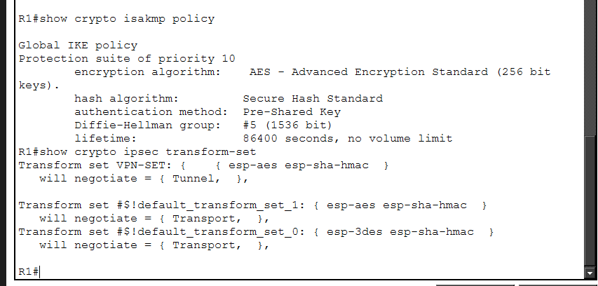
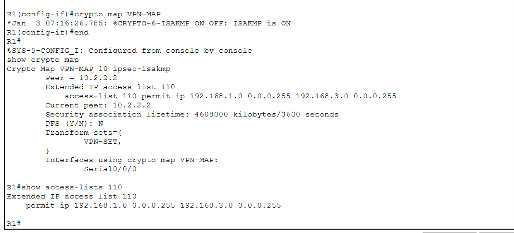
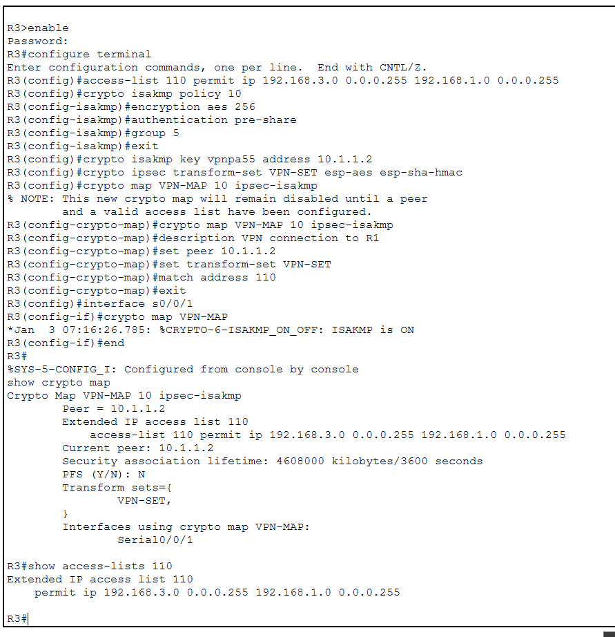
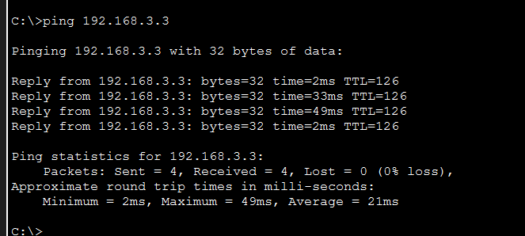
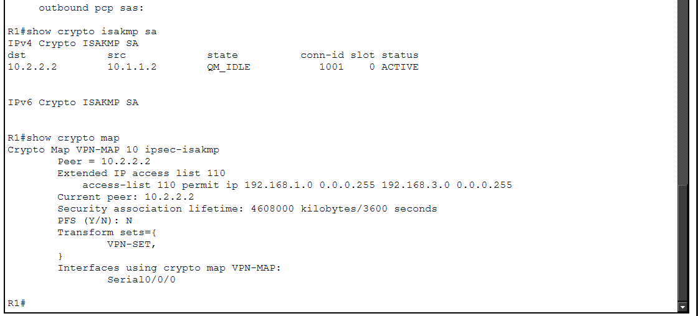
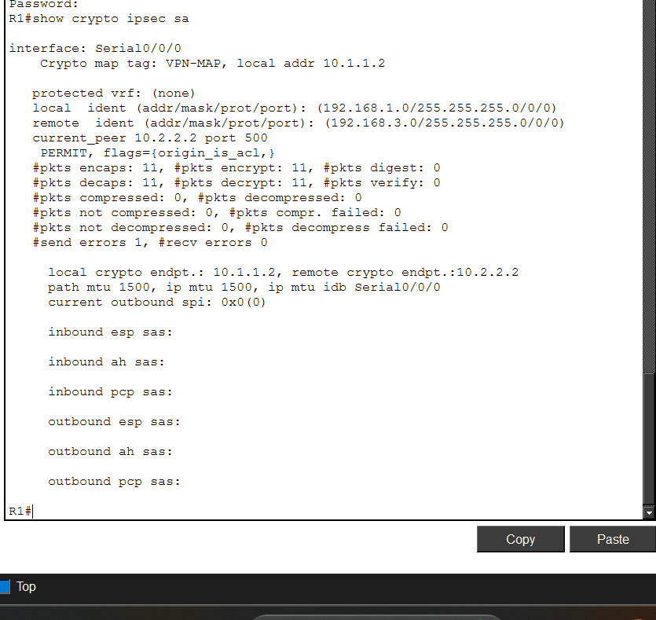
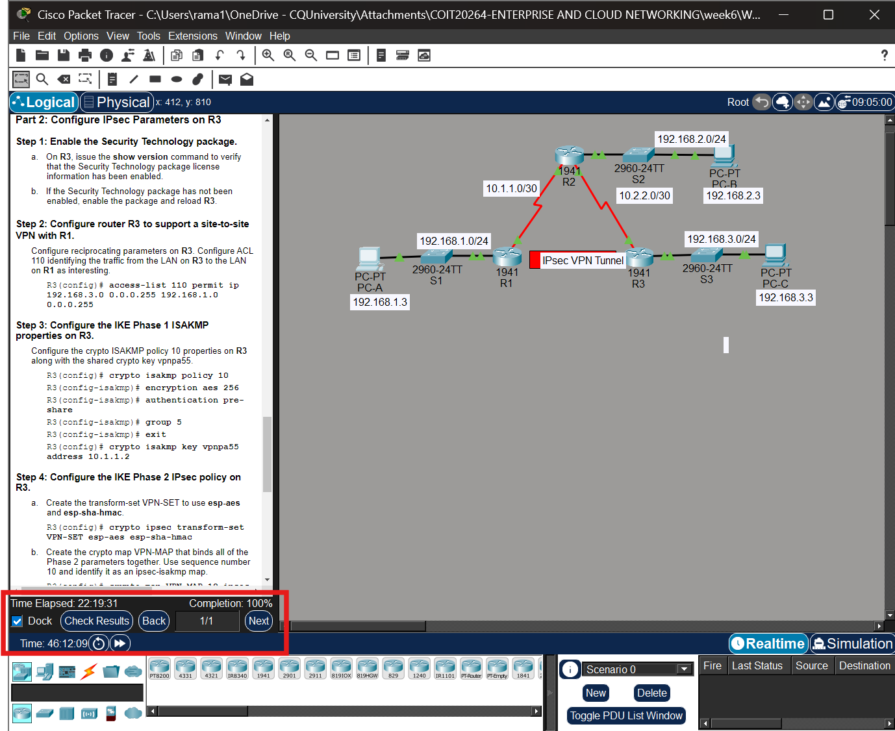

# Week 6 – Site-to-Site IPsec VPN

## Overview

I worked on configuring and testing a site-to-site IPsec VPN in Cisco Packet Tracer.

The network consisted of three routers, R1, R2 and R3. The VPN was configured between R1 and R3 so that traffic between the `192.168.1.0/24` and `192.168.3.0/24` LANs could be protected.

The main activities completed were:

- Verified connectivity before VPN configuration
- Enabled the Security Technology package
- Configured IPsec parameters on R1
- Configured matching IPsec parameters on R3
- Configured ISAKMP/IKE Phase 1
- Configured IPsec Phase 2
- Applied the crypto map to the WAN interfaces
- Generated interesting traffic between the two LANs
- Verified the VPN tunnel and encrypted packets
- Investigated VPN solutions for the assignment scenario

---

# Part 1 – Configure IPsec Parameters on R1

## Enable the Security Technology Package

I first checked the router software and technology package using the `show version` command.

The Security Technology package was initially disabled, so I enabled the `securityk9` package and reloaded R1.

After the reload, I checked the router again and confirmed that `securityk9` was enabled.

### Evidence

*Figure 1: R1 ISAKMP policy configured with AES-256, pre-shared key authentication and Diffie-Hellman Group 5, together with the VPN-SET IPsec transform set.*

---

## Configure R1 for Site-to-Site VPN

An extended ACL 110 was configured to identify traffic that should be protected by the VPN.

The interesting traffic was between:

- R1 LAN: `192.168.1.0/24`
- R3 LAN: `192.168.3.0/24`

The ACL used was:

`access-list 110 permit ip 192.168.1.0 0.0.0.255 192.168.3.0 0.0.0.255`

IKE Phase 1 was then configured using:

- Encryption: AES 256
- Authentication: Pre-shared key
- Diffie-Hellman Group: 5
- Pre-shared key: `vpnpa55`

For Phase 2, I created the `VPN-SET` transform set using ESP-AES and ESP-SHA-HMAC.

A crypto map named `VPN-MAP` was then configured with R3 as the peer and ACL 110 as the interesting traffic ACL.

The crypto map was applied to R1's `Serial0/0/0` interface.

### Evidence

*Figure 2: R1 VPN-MAP configuration and ACL 110 for traffic between the 192.168.1.0/24 and 192.168.3.0/24 networks.*

---

# Part 2 – Configure IPsec Parameters on R3

I configured R3 with matching VPN parameters so that it could establish the VPN tunnel with R1.

ACL 110 on R3 identified traffic in the opposite direction:

`192.168.3.0/24` to `192.168.1.0/24`

R3 used the same:

- AES 256 encryption
- Pre-shared authentication
- Diffie-Hellman Group 5
- Pre-shared key `vpnpa55`
- `VPN-SET` transform set
- `VPN-MAP` crypto map

The peer address on R3 was R1's WAN address `10.1.1.2`.

The crypto map was applied to R3's `Serial0/0/1` interface.

### Evidence

*Figure 3: R3 configured with the matching IPsec VPN parameters, VPN-MAP and ACL 110.*

---

# Part 3 – Verify the IPsec VPN

## Step 1 – Verify the VPN Before Interesting Traffic

Before generating new interesting traffic, I checked the IPsec security association using:

`show crypto ipsec sa`

This command provides information about the IPsec tunnel and packet encryption/decryption counters.

---

## Step 2 – Generate Interesting Traffic

From PC-A, I pinged PC-C using:

`ping 192.168.3.3`

The first test initially had some packet loss while the VPN tunnel was being established.

After the tunnel was established, I repeated the ping and received replies successfully.

### Evidence

*Figure 4: Successful ping from PC-A to PC-C (192.168.3.3) with 0% packet loss.*

---

## Step 3 – Verify the ISAKMP Security Association

On R1, I used:

`show crypto isakmp sa`

The result showed the VPN peer and the state:

`QM_IDLE`

This indicated that the ISAKMP security association had been successfully established.

---

## Step 4 – Verify the Crypto Map

I also checked the crypto map using:

`show crypto map`

The output confirmed:

- Crypto map: `VPN-MAP`
- Peer: `10.2.2.2`
- ACL: `110`
- Transform set: `VPN-SET`
- Interface: `Serial0/0/0`

### Evidence

*Figure 5: R1 ISAKMP security association in QM_IDLE state and the VPN-MAP crypto map configuration.*
---

## Step 5 – Verify the Interesting Traffic ACL

I checked ACL 110 using:

`show access-lists 110`

The ACL displayed a match for traffic between the two protected LANs.

This showed that traffic from the R1 LAN to the R3 LAN was matching the VPN ACL.

---

## Step 6 – Verify IPsec Encrypted and Decrypted Packets

Finally, I used:

`show crypto ipsec sa`

The output showed packet counters for the VPN.

The result included:

- `#pkts encaps: 11`
- `#pkts encrypt: 11`
- `#pkts decaps: 11`
- `#pkts decrypt: 11`

This showed that packets were being encrypted before transmission and decrypted after being received through the IPsec VPN.

### Evidence

*Figure 6: R1 IPsec security association showing 11 packets encrypted and 11 packets decrypted after VPN traffic was generated.*

---

# Final Packet Tracer Result

After completing the configuration and verification, Packet Tracer showed:

**Completion: 100%**

This confirmed that the required configuration for the activity was completed successfully.

### Evidence

*Figure 7: Cisco Packet Tracer activity showing 100% completion.*

---

# VPN Solutions for the Assignment Scenario

The assignment scenario for Pacific Haven Resorts & Hotels (PHRH) includes different locations, cloud services and staff who need secure remote access. Because information needs to travel between different networks, VPN technology can be used to protect the communication.

## Site-to-Site IPsec VPN

A site-to-site IPsec VPN can be used to securely connect the PHRH locations across the Internet.

For example, the VPN can connect the Brisbane headquarters with the Sunshine Coast and Gold Coast locations. It can also be used for secure communication between the organisation's network and cloud environment.

This is similar to the Week 6 Packet Tracer activity because R1 and R3 represented two different LANs connected through an IPsec VPN.

IPsec is suitable for this type of connection because traffic travelling between the sites can be encrypted before it passes through an untrusted network.

## Remote-Access VPN

PHRH also has staff who need to work remotely. A remote-access VPN can provide secure access for authorised staff connecting from outside the organisation.

This would allow remote employees to securely access internal systems and services without directly exposing those internal resources to the public Internet.

An SSL/TLS-based remote-access VPN could be considered for mobile and remote users because it provides encrypted access from external locations.

## Suitable Use in the PHRH Network

For the PHRH scenario, the two VPN approaches can serve different purposes:

| VPN Solution | Possible Use |
|---|---|
| Site-to-Site IPsec VPN | Secure communication between headquarters, hotel locations and cloud networks |
| Remote-Access VPN | Secure access for staff working remotely or travelling |

Using these VPN approaches would support the hybrid network design by protecting communication between PHRH locations, cloud services and authorised remote users.

---

# Reflection

This week's activity helped me understand how a site-to-site IPsec VPN is configured and verified in Cisco Packet Tracer.

I learned that both VPN peers need matching parameters such as the encryption method, authentication method, Diffie-Hellman group, pre-shared key and IPsec transform set.

I also learned the difference between IKE Phase 1 and IPsec Phase 2. Phase 1 establishes the secure relationship between the VPN peers, while Phase 2 is used to protect the actual data traffic.

The verification commands helped me understand how to check whether the VPN is operating correctly. The `QM_IDLE` state showed that the ISAKMP security association was established, while the IPsec packet counters showed that traffic was being encrypted and decrypted.

Finally, I could relate this practical activity to the PHRH network design in the assignment. Site-to-site VPNs can protect communication between different PHRH locations, while remote-access VPNs can provide secure connectivity for staff working outside the organisation.
