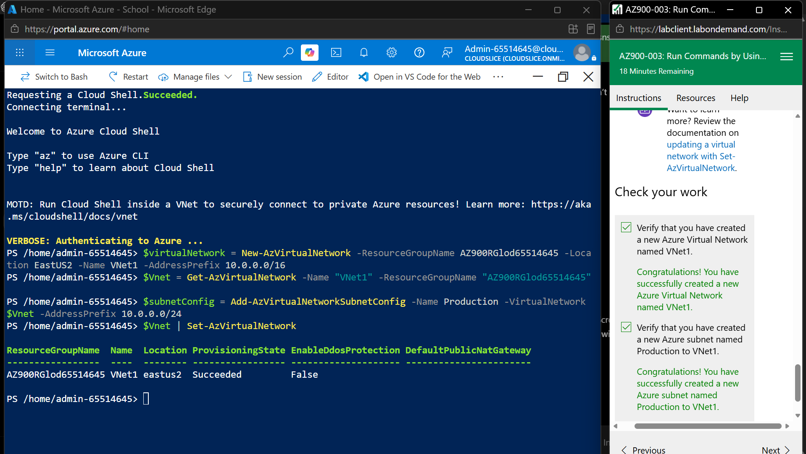
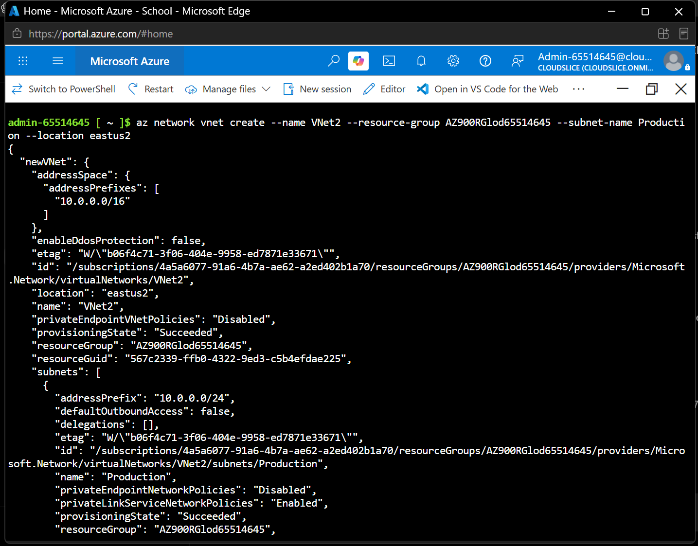
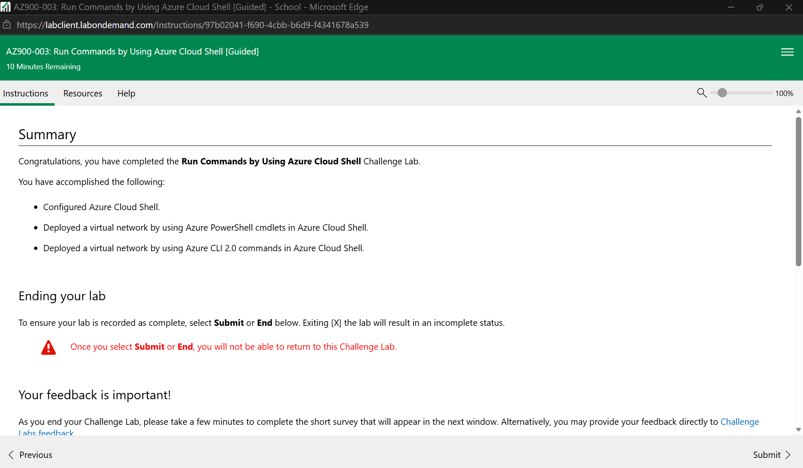
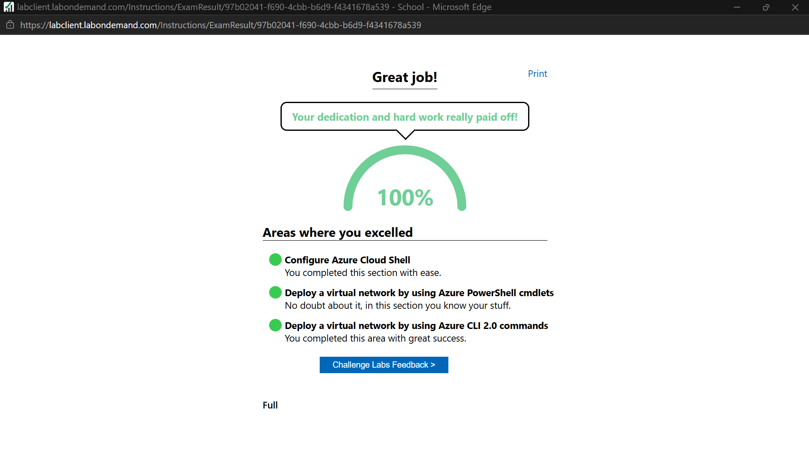

# Week 7 – Azure Cloud Shell

## Part 1 – Run Commands by Using Azure Cloud Shell

### Overview

In this activity, I used Azure Cloud Shell to work with Azure resources using both PowerShell and Azure CLI.

The main activities I completed were:

- Configured Azure Cloud Shell
- Used Azure PowerShell commands
- Created a virtual network using PowerShell
- Created a subnet named `Production`
- Switched to Bash in Azure Cloud Shell
- Used Azure CLI commands
- Created another virtual network using Azure CLI
- Verified successful completion of the Challenge Lab

---

## Azure PowerShell

I first used PowerShell in Azure Cloud Shell to create a virtual network named `VNet1`.

The virtual network was created in the resource group provided by the lab and used the address space:

`10.0.0.0/16`

I then added a subnet named `Production` with the address prefix:

`10.0.0.0/24`

The PowerShell output showed the provisioning state as `Succeeded`, confirming that the virtual network was created successfully.

### Evidence

*Figure 1: VNet1 and the Production subnet successfully configured using Azure PowerShell.*

---

## Azure CLI

Next, I switched Azure Cloud Shell from PowerShell to Bash and used Azure CLI commands.

I created another virtual network named `VNet2` with:

- Address space: `10.0.0.0/16`
- Subnet name: `Production`
- Subnet address prefix: `10.0.0.0/24`
- Region: `East US 2`

The command output showed `provisioningState: Succeeded`, confirming that the virtual network and subnet were successfully created.

### Evidence

*Figure 2: VNet2 and the Production subnet successfully created using Azure CLI.*

---

## Challenge Lab Completion

After completing both the PowerShell and Azure CLI activities, I submitted the Challenge Lab.

The final result showed **100% completion** for:

- Configure Azure Cloud Shell
- Deploy a virtual network using Azure PowerShell cmdlets
- Deploy a virtual network using Azure CLI 2.0 commands

### Evidence

*Figure 3: AZ900-003 Azure Cloud Shell Challenge Lab completed with 100%.*

---

## Reflection

This activity helped me understand how Azure resources can be created and managed without using only the Azure Portal interface. I used both PowerShell and Azure CLI in Azure Cloud Shell to create virtual networks and subnets.

I also learned that the same type of Azure resource can be deployed using different command-line tools. PowerShell uses Azure cmdlets, while Azure CLI uses `az` commands. The successful deployment of `VNet1` and `VNet2` helped me understand how command-line tools can be used for Azure network configuration.
