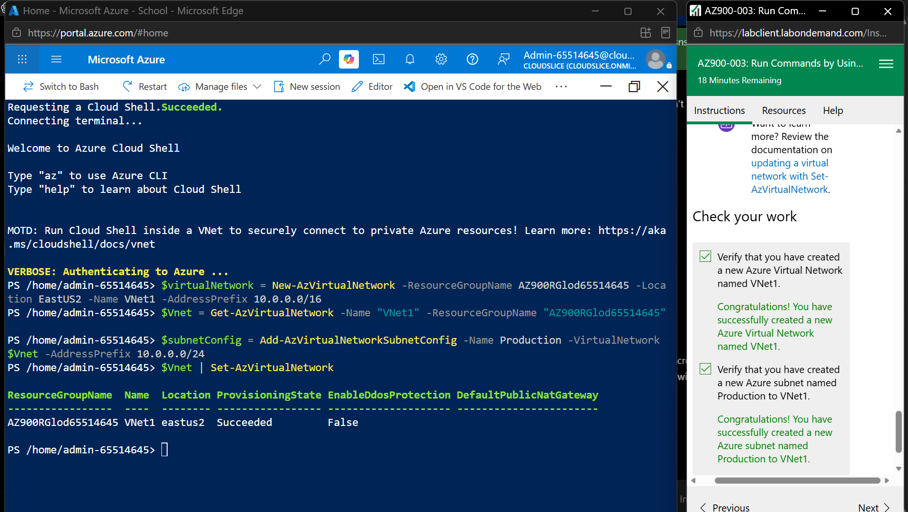
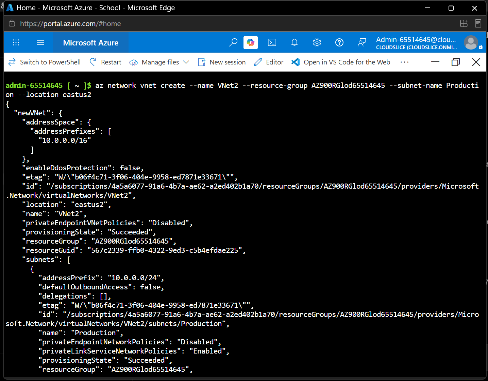
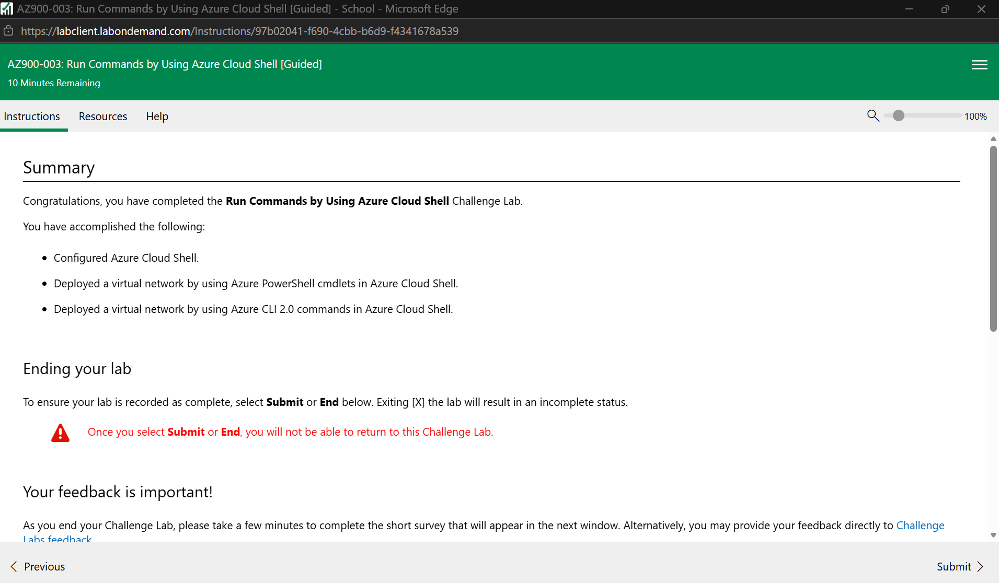
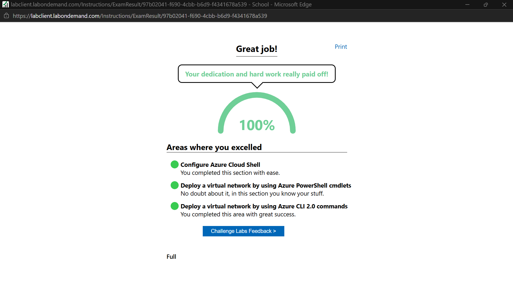
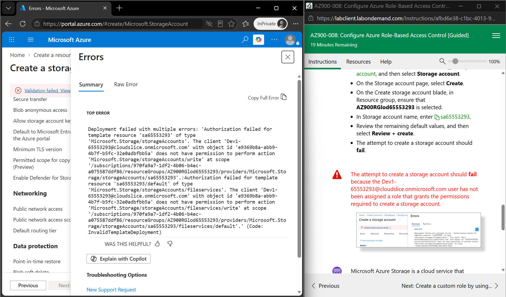
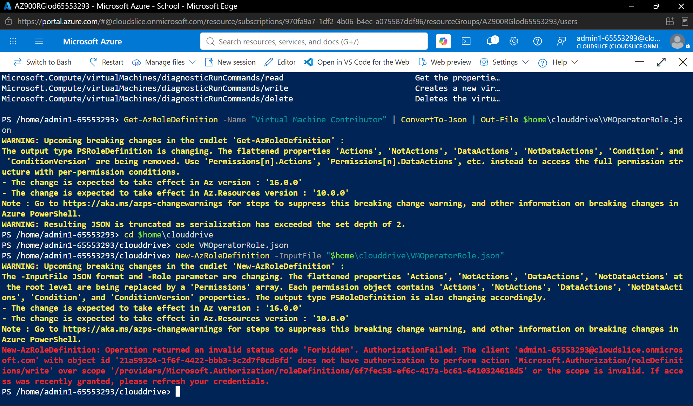
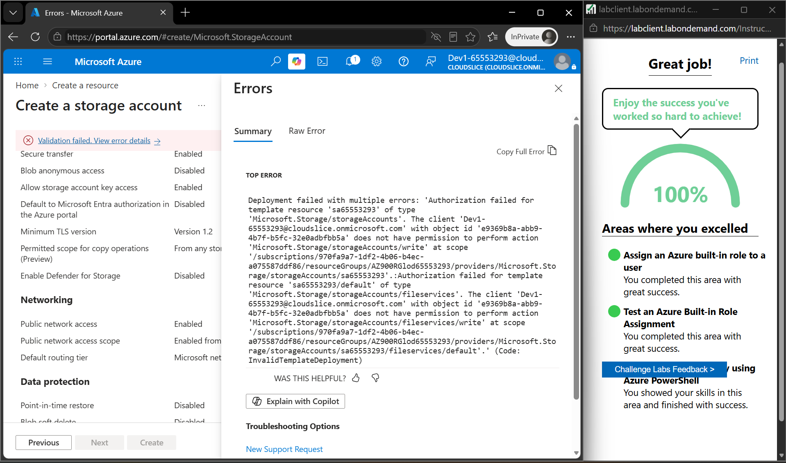

# Week 7 – Azure Cloud Shell

## Part 1 – Run Commands by Using Azure Cloud Shell

### Overview

In this activity, I used Azure Cloud Shell to work with Azure resources using both PowerShell and Azure CLI.

The main activities I completed were:

- Configured Azure Cloud Shell
- Used Azure PowerShell commands
- Created a virtual network using PowerShell
- Created a subnet named `Production`
- Switched to Bash in Azure Cloud Shell
- Used Azure CLI commands
- Created another virtual network using Azure CLI
- Verified successful completion of the Challenge Lab

---

## Azure PowerShell

I first used PowerShell in Azure Cloud Shell to create a virtual network named `VNet1`.

The virtual network was created in the resource group provided by the lab and used the address space:

`10.0.0.0/16`

I then added a subnet named `Production` with the address prefix:

`10.0.0.0/24`

The PowerShell output showed the provisioning state as `Succeeded`, confirming that the virtual network was created successfully.

### Evidence

*Figure 1: VNet1 and the Production subnet successfully configured using Azure PowerShell.*

---

## Azure CLI

Next, I switched Azure Cloud Shell from PowerShell to Bash and used Azure CLI commands.

I created another virtual network named `VNet2` with:

- Address space: `10.0.0.0/16`
- Subnet name: `Production`
- Subnet address prefix: `10.0.0.0/24`
- Region: `East US 2`

The command output showed `provisioningState: Succeeded`, confirming that the virtual network and subnet were successfully created.

### Evidence

*Figure 2: VNet2 and the Production subnet successfully created using Azure CLI.*

---

## Challenge Lab Completion

After completing both the PowerShell and Azure CLI activities, I submitted the Challenge Lab.

The final result showed **100% completion** for:

- Configure Azure Cloud Shell
- Deploy a virtual network using Azure PowerShell cmdlets
- Deploy a virtual network using Azure CLI 2.0 commands

### Evidence

*Figure 3: AZ900-003 Azure Cloud Shell Challenge Lab completed with 100%.*

---

## Task 2 – Configure Azure Role-Based Access Control (AZ900-008)

In this guided lab, I learned how Azure Role-Based Access Control (RBAC) can be used to control what actions a user is allowed to perform on Azure resources.

### Assigning a Built-in Role

I assigned the **Network Contributor** built-in role to the Dev1 user at the resource group level. This role allowed the user to manage networking resources within the assigned resource group.

### Testing the Role Assignment

To test the permissions, I signed in as the **Dev1** user using an InPrivate browser window.

I successfully created a virtual network with the following configuration:

- Virtual network: `VNet1`
- Region: `East US 2`
- IPv4 address space: `10.0.0.0/16`
- Subnet: `Production`
- Subnet range: `10.0.0.0/24`

The successful creation of the VNet showed that the Network Contributor role provided the required networking permissions.

### Testing Restricted Access

I then attempted to create a storage account while signed in as the Dev1 user. The deployment failed with an **AuthorizationFailed** error.

This was the expected result because the Dev1 user had permission to manage network resources but did not have permission to create storage accounts. This demonstrated how RBAC can restrict users to only the resources and actions required for their role.

*Figure: Storage account creation failed because the Dev1 user did not have the required permission.*

### Creating a Custom Role with Azure PowerShell

Next, I switched back to the administrator account and opened **Azure Cloud Shell using PowerShell**.

I used the following command to view the available operations for Azure virtual machines:

`Get-AzProviderOperation "Microsoft.Compute/virtualmachines/*" | FT Operation, Description -AutoSize`

I then retrieved the built-in **Virtual Machine Contributor** role and saved its definition as `VMOperatorRole.json`.

The JSON role definition was modified to create a custom role named **Virtual Machine Operator**. I configured the role with only the following actions:

- `Microsoft.Compute/*/read`
- `Microsoft.Compute/virtualMachines/start/action`
- `Microsoft.Compute/virtualMachines/deallocate/action`

This means the custom role was designed to allow users to view, start and deallocate virtual machines without providing all Virtual Machine Contributor permissions.

### Testing the Custom Role

I attempted to create the custom role using:

`New-AzRoleDefinition -InputFile "$home\clouddrive\VMOperatorRole.json"`

The command returned a **Forbidden / AuthorizationFailed** error. This was expected in the guided lab because the CloudSlice environment restricts permission to create custom Azure roles.

*Figure: Expected Forbidden error when attempting to create the custom Virtual Machine Operator role.*

### Lab Completion

The guided lab verification confirmed that all required activities were successfully completed with a score of **100%**.

*Figure: Successful completion of the AZ900-008 Configure Azure Role-Based Access Control guided lab.*

## Reflection

- I learned how to use Azure Cloud Shell with both PowerShell and Azure CLI.

- Creating `VNet1` and `VNet2` helped me understand how Azure networks and subnets can be deployed using command-line tools.

- I learned that PowerShell uses Azure cmdlets, while Azure CLI uses `az` commands to manage Azure resources.

- The RBAC activity helped me understand how Azure controls user access using roles and permissions.

- Testing the Network Contributor role showed that Dev1 could create networking resources but could not create a storage account.

- I also learned how built-in Azure roles can be modified to design custom roles with specific permissions.

- Overall, these activities gave me practical experience with Azure networking, command-line tools and access control.
