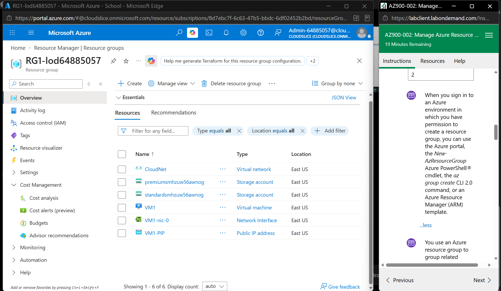
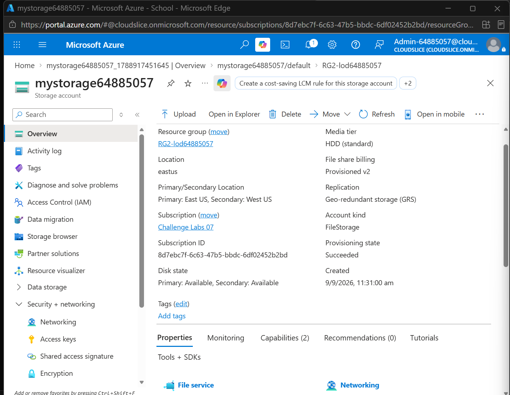
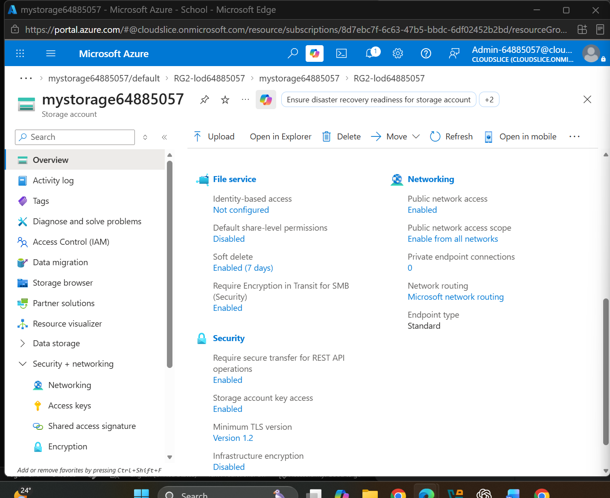
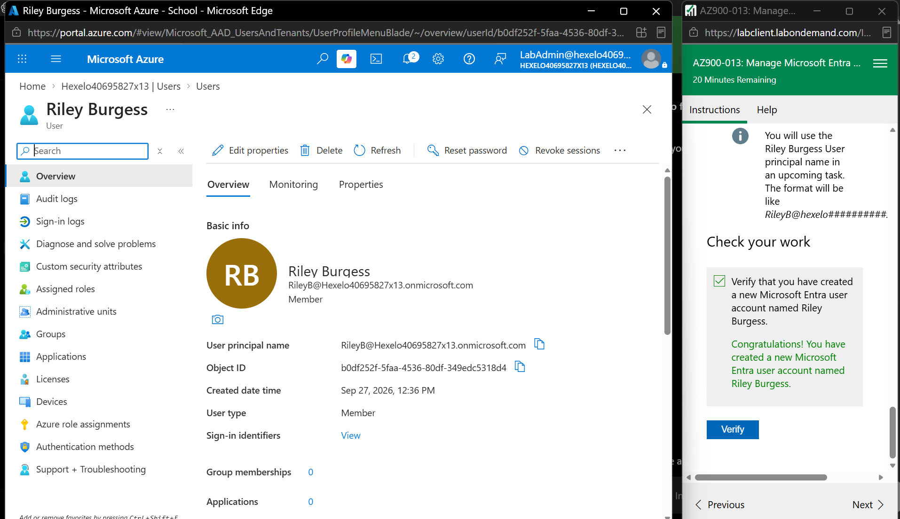
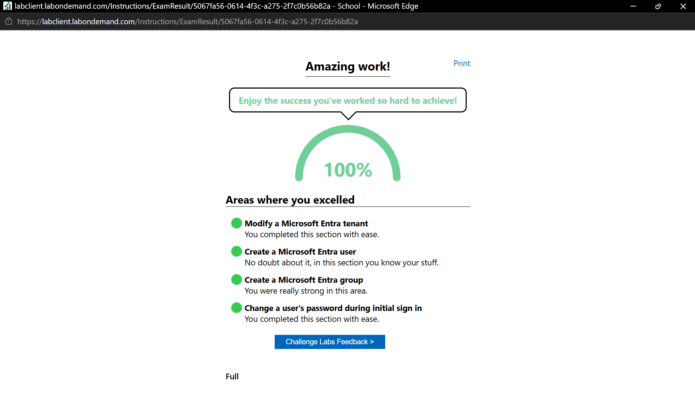

# Week 8 – Azure Resource Management and Microsoft Entra

## Portfolio Task 1 – Manage Azure Resource Groups

In this task, I used the Azure Portal to explore resource groups, view existing resources, create a new resource, and examine the management options available for an Azure resource.

### Step 1 – View Resources in a Resource Group

I opened the existing resource group `RG1-lod64885057` and viewed the resources available inside it. The resource group contained six resources, including a virtual network, storage accounts, a virtual machine, a network interface and a public IP address.

*Figure 1: Resources available in the RG1 resource group.*

### Step 2 – Create a Resource in a Resource Group

I worked with the `RG2-lod64885057` resource group and created the storage account `mystorage64885057`. The storage account was successfully deployed and its provisioning state showed `Succeeded`.

*Figure 2: Storage account successfully created in the RG2 resource group.*

### Step 3 – View Resource Management Options

I opened the storage account and explored the available management options in the Azure Portal. The resource menu provided options such as Activity log, Access Control (IAM), Data migration, Storage browser, Networking, Access keys, Shared access signature and Encryption.

*Figure 3: Management options available for the Azure storage account.*

---

## Portfolio Task 2 – Manage Microsoft Entra Users and Groups

### Overview

In this activity, I worked with Microsoft Entra ID to understand how users and groups can be managed in Azure. I modified the Microsoft Entra tenant information, created a new user, created a security group, added the user to the group, and completed the initial sign-in process for the new user.

### 1. Microsoft Entra Tenant

I accessed the Microsoft Entra ID tenant and updated the tenant technical contact information. This helped me understand where basic tenant information and settings can be managed.

*Figure 4: Microsoft Entra tenant information successfully updated.*

### 2. Create a Microsoft Entra User

I created a new Microsoft Entra user named **Riley Burgess**. The user was created with the username `RileyB` and was added to the tenant as a member.

*Figure 5: Microsoft Entra user Riley Burgess successfully created.*

### 3. Create a Microsoft Entra Group

I created a security group named **MyGroup** and added **Riley Burgess** as a member. This showed how groups can be used to organise users and manage access for multiple users.

*Figure 6: MyGroup successfully created with Riley Burgess added as a member.*

### 4. Initial User Sign-In and Password Change

I signed in to Azure using the newly created Riley Burgess account and completed the initial password change process. This demonstrated the initial sign-in process for a newly created Microsoft Entra user.

*Figure 7: Initial sign-in and password change completed for the Riley Burgess account.*

### Lab Completion

The AZ900-013 guided lab was successfully completed with a final result of **100%**. The completed activities included modifying the Microsoft Entra tenant, creating a user, creating a group, and completing the initial user sign-in and password change.

*Figure 8: AZ900-013 Manage Microsoft Entra Users and Groups guided lab completed with 100%.*

### Discussion – Users and Groups for an Application Scenario

For an application, individual user accounts can be created for people who need access to the system. Users with similar responsibilities can then be placed into groups. For example, separate groups could be created for administrators, staff and normal users. This can make access management easier because permissions can be assigned based on the user's group instead of managing every user individually.

### What I Learned

- I learned how Microsoft Entra ID can be used to manage identities in a cloud environment.
- I learned how to create a new Microsoft Entra user account.
- I learned how to create a security group and add a user as a member.
- I learned how tenant information can be viewed and updated.
- I completed the initial sign-in and password change process for a new user.
- I understood how groups can make user and access management easier when managing multiple users.
