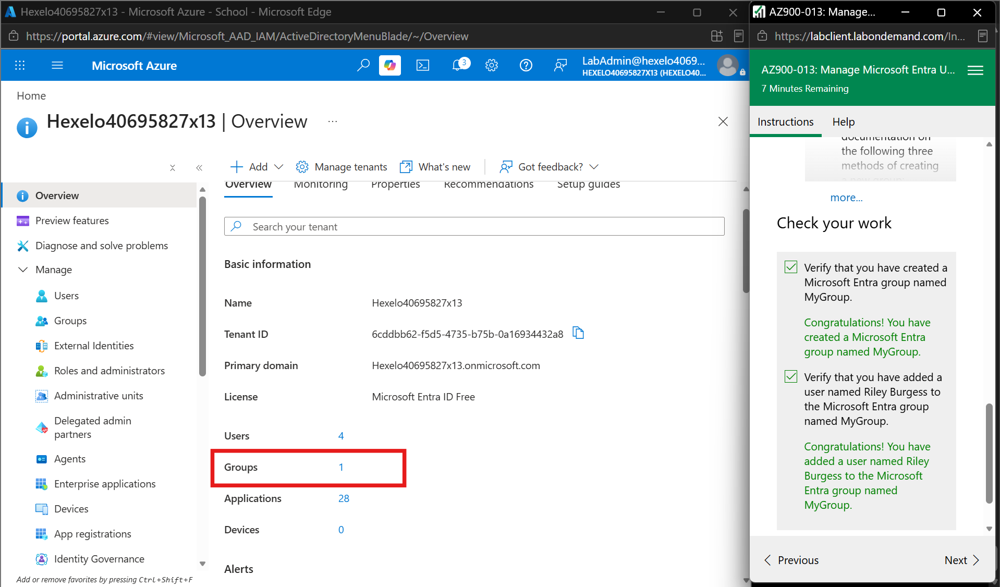
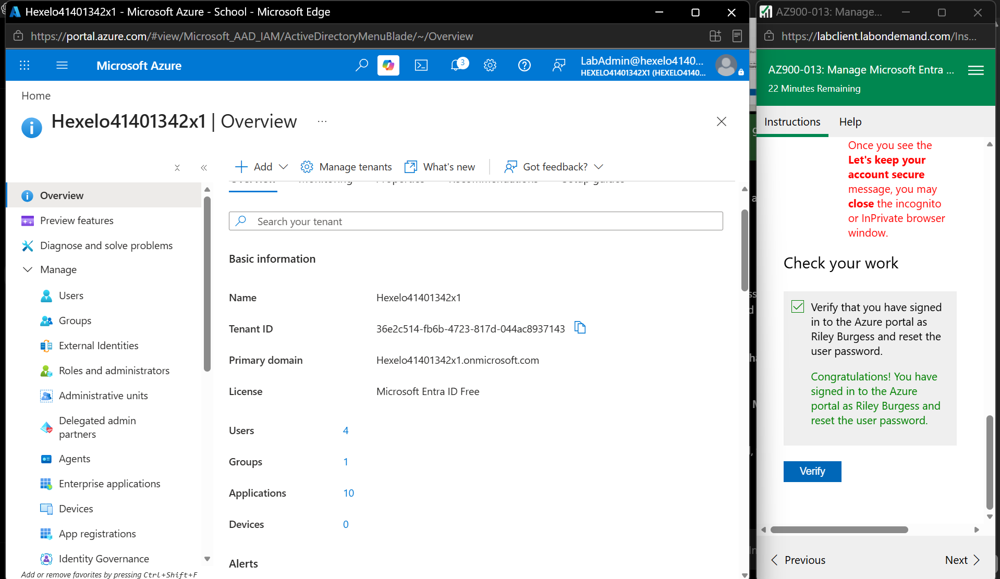

# Week 8 – Azure Resource Management and Microsoft Entra

## Overview

In Week 8, I completed practical activities related to **Azure Resource Management** and **Microsoft Entra ID**. The first task focused on working with Azure resource groups and understanding how cloud resources are organised and managed. The second task focused on identity management by creating a Microsoft Entra user and group and completing the initial user sign-in process.

These activities helped me understand both **resource management** and **identity management** in Microsoft Azure.

---

## Portfolio Task 1 – Manage Azure Resource Groups

Azure resource groups are used to organise and manage related Azure resources together. In this activity, I used the Azure Portal to explore existing resource groups, view the resources inside them, create a new resource, and examine the management options available for an Azure resource.

### Step 1 – View Resources in a Resource Group

I opened the existing resource group `RG1-lod64885057` and viewed the resources available inside it. The resource group contained six resources, including a virtual network, storage accounts, a virtual machine, a network interface and a public IP address.

*Figure 1: Resources available in the RG1 resource group.*

### Step 2 – Create a Resource in a Resource Group

I then worked with the `RG2-lod64885057` resource group and created the storage account `mystorage64885057`. The storage account was successfully deployed and its provisioning state showed `Succeeded`.

This activity showed me how new Azure resources can be created and organised inside a selected resource group.

*Figure 2: Storage account successfully created in the RG2 resource group.*

### Step 3 – View Resource Management Options

After creating the storage account, I opened it and explored the available management options in the Azure Portal. The resource menu provided options such as Activity log, Access Control (IAM), Data migration, Storage browser, Networking, Access keys, Shared access signature and Encryption.

This showed that an Azure resource can be configured and managed from different areas depending on its security, networking, access and monitoring requirements.

*Figure 3: Management options available for the Azure storage account.*

### What I Learned

- I learned how Azure resource groups are used to organise related cloud resources.
- I viewed different resource types contained within an existing resource group.
- I learned how a new Azure resource can be created inside a resource group.
- I explored the management, security and networking options available for a storage account.
- This activity helped me understand how resource groups make Azure resources easier to organise and manage.

---

## Portfolio Task 2 – Manage Microsoft Entra Users and Groups

Microsoft Entra ID provides identity and access management for users in a cloud environment. In this activity, I created a new user, created a security group, added the user to the group, and completed the initial sign-in and password change process.

### Step 1 – Create a Microsoft Entra User

I created a new Microsoft Entra user named **Riley Burgess**. The user was created as a member of the Microsoft Entra tenant.

This demonstrated how individual user identities can be created and managed through Microsoft Entra ID.

*Figure 4: Microsoft Entra user Riley Burgess successfully created.*

### Step 2 – Create a Microsoft Entra Group

I created a Microsoft Entra security group named **MyGroup** and added **Riley Burgess** as a member. The lab verification confirmed that the group was created and Riley Burgess was successfully added to it.

Using groups can make user management easier because users with similar access requirements can be organised together.

*Figure 5: MyGroup successfully created with Riley Burgess added as a member.*

### Step 3 – Initial Sign-In and Password Change

I signed in to Azure using the Riley Burgess account and completed the initial password change process. The lab verification confirmed that the sign-in and password change were completed successfully.

This activity demonstrated the initial sign-in process that a newly created user may complete before accessing cloud services.

*Figure 6: Initial sign-in and password change successfully completed for Riley Burgess.*

### Step 4 – Lab Completion

The **AZ900-013 – Manage Microsoft Entra Users and Groups** guided lab was successfully completed with a final result of **100%**.

The completed activities included modifying the Microsoft Entra tenant, creating a Microsoft Entra user, creating a Microsoft Entra group, and completing the user's initial sign-in and password change.

*Figure 7: AZ900-013 Manage Microsoft Entra Users and Groups guided lab completed with 100%.*

### Discussion – Users and Groups for an Application Scenario

For an application, separate user accounts can be created for people who need access to the system. Users with similar responsibilities can then be organised into groups. For example, groups could be created for administrators, staff and normal users.

This approach can make access management easier because permissions can be assigned according to a user's role or group instead of managing every user separately.

### What I Learned

- I learned how Microsoft Entra ID can be used to manage identities in a cloud environment.
- I learned how to create and manage a Microsoft Entra user.
- I learned how to create a security group and add a user as a member.
- I learned how the initial sign-in and password change process works for a new user.
- I understood how groups can make identity and access management easier when managing multiple users.

---

## Week 8 Reflection

This week's activities gave me practical experience with two important areas of Azure. Resource groups helped me understand how Azure resources can be organised and managed, while Microsoft Entra ID showed me how users and groups can be managed for identity and access control.

Overall, the activities helped me understand that cloud administration involves not only creating resources but also organising those resources and controlling who can access them.
