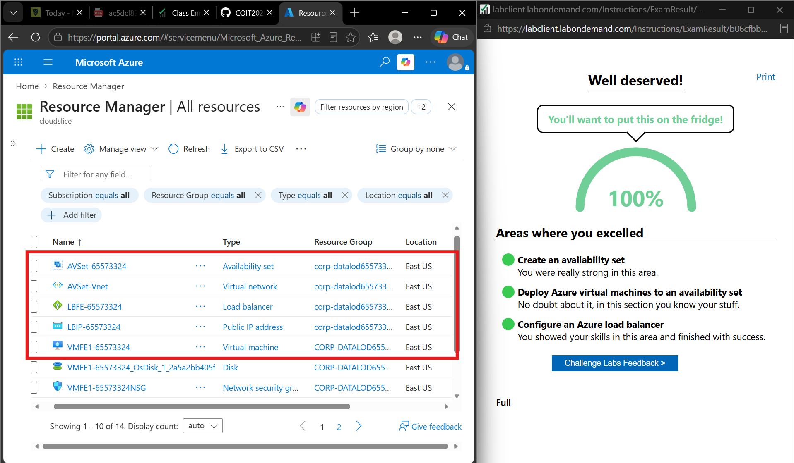

# Week 9 – Azure High Availability and Resource Management

## Overview

During Week 9, I completed practical activities using Microsoft Azure. The activities helped me understand high availability, Availability Sets, virtual machines, Azure Load Balancer, resource groups, and Azure resource management.

In Portfolio Task 1, I configured a high-availability environment using an Azure Availability Set, two Windows Server virtual machines and an Azure Load Balancer.

In Portfolio Task 2, I worked with Azure resource groups and resource management. I viewed resources inside resource groups, created a storage account and reviewed its configuration.

---

# Portfolio Task 1 – High Availability Using Availability Sets

## Introduction

In this task, I configured high availability in Microsoft Azure using an Availability Set. The activity involved creating an availability set and virtual network, deploying two Windows Server virtual machines, verifying the virtual machines using Azure CLI, and configuring an Azure Load Balancer.

An Azure Availability Set helps improve the availability of virtual machines by distributing them across fault domains and update domains. This reduces the possibility of all virtual machines becoming unavailable at the same time because of hardware failure or planned maintenance.

---

## 1. Availability Set and Virtual Network

I first created an Azure Availability Set and a virtual network named `AVSet-Vnet`.

The virtual network provided network connectivity for the virtual machines used in the activity. The Availability Set was used to place the virtual machines into a high-availability configuration.


*Figure 1: Successful deployment of the virtual network for the high-availability environment.*

---

## 2. Deploying the First Virtual Machine

I used Azure Cloud Shell with Bash and Azure CLI to deploy the first Windows Server virtual machine.

The `az vm create` command was used to specify the resource group, VM name, location, Availability Set, Windows Server image, VM size, administrator credentials, storage type, virtual network and subnet.

```bash
az vm create \
  --resource-group "$RG" \
  --name "$VM1" \
  --location "$LOCATION" \
  --availability-set "$AVSET" \
  --image "MicrosoftWindowsServer:WindowsServer:2022-datacenter:latest" \
  --size "$SIZE" \
  --admin-username "$ADMIN_USER" \
  --admin-password "$ADMIN_PASSWORD" \
  --storage-sku Standard_LRS \
  --vnet-name "$VNET" \
  --subnet "$SUBNET" \
  --public-ip-sku Standard \
  --nsg-rule RDP
```

The virtual machine used the Windows Server 2022 Datacenter image and Standard LRS storage.

After the deployment completed, Azure showed that the virtual machine was running successfully.

---

## 3. Verifying the First Virtual Machine

After creating the first virtual machine, I used the `az vm show` command to verify its configuration.

```bash
az vm show \
  --resource-group "$RG" \
  --name "$VM1" \
  --query "{
    Name:name,
    ProvisioningState:provisioningState,
    AvailabilitySet:availabilitySet.id,
    ImageSKU:storageProfile.imageReference.sku,
    DiskType:storageProfile.osDisk.managedDisk.storageAccountType
  }" \
  --output table
```

The command displayed important information including the VM name, provisioning state, Availability Set, Windows Server image SKU and disk type.

The output showed that the `ProvisioningState` was `Succeeded` and confirmed that the virtual machine was associated with the Availability Set.


*Figure 2: Azure CLI verification of the first virtual machine and its Availability Set.*

---

## 4. Deploying the Second Virtual Machine

I then deployed a second Windows Server virtual machine using the same Availability Set and virtual network.

```bash
az vm create \
  --resource-group "$RG" \
  --name "$VM2" \
  --location "$LOCATION" \
  --availability-set "$AVSET" \
  --image "MicrosoftWindowsServer:WindowsServer:2022-datacenter:latest" \
  --size "$SIZE" \
  --admin-username "$ADMIN_USER" \
  --admin-password "$ADMIN_PASSWORD" \
  --storage-sku Standard_LRS \
  --vnet-name "$VNET" \
  --subnet "$SUBNET" \
  --public-ip-sku Standard \
  --nsg-rule RDP
```

The second VM used the same Windows Server image and Availability Set configuration.

After the deployment, the output showed that the second virtual machine was also running successfully.

---

## 5. Verifying Both Virtual Machines

I used Azure CLI to verify both virtual machines and confirm that they were successfully provisioned in the same Availability Set.

```bash
for VM in "$VM1" "$VM2"; do
  az vm show \
    --resource-group "$RG" \
    --name "$VM" \
    --query "{
      Name:name,
      ProvisioningState:provisioningState,
      AvailabilitySet:availabilitySet.id,
      ImageSKU:storageProfile.imageReference.sku,
      DiskType:storageProfile.osDisk.managedDisk.storageAccountType
    }" \
    --output table
done
```

The output showed `Succeeded` for both virtual machines and displayed the same Availability Set information.


*Figure 3: Azure CLI verification showing both virtual machines successfully deployed in the Availability Set.*

---

## 6. Azure Load Balancer

After deploying the two virtual machines, I configured an Azure Load Balancer.

The load balancer configuration included:

- Frontend public IP configuration
- Backend pool
- Two backend virtual machines
- Health probe
- Load-balancing rule

The frontend configuration provides the address that receives incoming traffic. The backend pool contains the virtual machines that can receive the traffic.

---

## 7. Backend Pool

I configured the backend pool and added the IP configurations of both virtual machines.

Both virtual machines were running inside the same virtual network and were added as backend instances.

This allows incoming traffic received by the Azure Load Balancer to be distributed between the two virtual machines instead of relying on only one server.

---

## 8. Health Probe

I created a health probe for the load balancer using:

- **Protocol:** TCP
- **Port:** 80

The health probe is used to check whether the backend virtual machines are available.

If one of the backend virtual machines does not respond to the health probe, the load balancer can avoid sending new traffic to that instance.

---

## 9. Load-Balancing Rule

I created a load-balancing rule using TCP port `80`.

The rule connected the frontend IP configuration to the backend pool and used the health probe configured on port 80.

This configuration allows incoming web traffic to be distributed between the available backend virtual machines.



*Figure 4: Successful completion of the Azure high-availability activity using Availability Sets, virtual machines and Azure Load Balancer.*

---

## Task 1 Result

The guided high-availability activity was successfully completed with a result of **100%**.

During this activity, I successfully:

- Created an Azure Availability Set.
- Created the `AVSet-Vnet` virtual network.
- Deployed two Windows Server virtual machines.
- Added both virtual machines to the Availability Set.
- Verified VM provisioning using Azure CLI.
- Configured an Azure Load Balancer.
- Configured the frontend public IP.
- Added both VMs to the backend pool.
- Created a TCP port 80 health probe.
- Created a TCP port 80 load-balancing rule.

---

## What I Learned – Task 1

From this task, I learned how Azure Availability Sets can improve the availability of virtual machines. I also gained practical experience using Azure CLI commands such as `az vm create` and `az vm show` to deploy and verify virtual machines.

I learned how multiple virtual machines can be placed in the same Availability Set and connected through an Azure Load Balancer. The backend pool contains the virtual machines that can receive traffic, while the health probe checks their availability.

This activity helped me understand how Availability Sets, virtual networks, multiple virtual machines, health probes and Azure Load Balancers can work together in a high-availability environment.

---

# Portfolio Task 2 – Azure Resource Management

## Introduction

In this task, I worked with Azure resource groups and resource management using the Azure Portal. I viewed the available resource groups and their resources, created an Azure storage account and reviewed its configuration.

---

## 1. Viewing Azure Resource Groups

I opened **Resource groups** in the Azure Portal and viewed the available resource groups.

The activity included checking the number of resource groups and reviewing the resources contained inside them.


*Figure 5: Viewing and verifying Azure resource groups in the Azure Portal.*

This activity helped me understand that Azure resource groups provide a logical way to organise related cloud resources.

---

## 2. Creating a Storage Account

I created a new Azure storage account inside the second resource group.

The storage account deployment completed successfully, confirming that the new Azure resource was created in the selected resource group.


*Figure 6: Successful deployment of the Azure storage account in the selected resource group.*

---

## 3. Reviewing the Storage Account

After deployment, I opened the storage account and reviewed its configuration.

The storage account overview displayed information such as:

- Resource group
- Azure region
- Subscription
- Replication
- Account kind
- Provisioning state

The provisioning state showed `Succeeded`, confirming that the resource was successfully deployed.


*Figure 7: Reviewing the configuration and properties of the successfully created Azure storage account.*

---

## 4. Azure Resource Management

During the activity, I also explored the resource management options available through the Azure Portal.

Resource groups make it easier to organise and manage related Azure resources. Resources created for the same application or activity can be grouped together, making them easier to locate and manage.

The activity also demonstrated how new Azure resources can be created directly inside a selected resource group.

---

## Task 2 Result

The Azure Resource Management guided activity was successfully completed with a result of **100%**.

The activity included:

- Viewing Azure resource groups.
- Checking resources contained in the resource groups.
- Creating a new Azure resource.
- Creating a storage account inside a resource group.
- Reviewing the storage account configuration.
- Exploring Azure resource management options through the Azure Portal.


*Figure 8: Successful completion of the Azure Resource Management guided activity with 100%.*

---

## What I Learned – Task 2

From this task, I learned how Azure resource groups are used to organise and manage cloud resources.

I learned how to view resources inside a resource group, create a new resource in a selected resource group, and review resource configuration through the Azure Portal.

Creating and reviewing the storage account also helped me understand how an Azure resource is associated with a resource group, subscription and deployment region.

---

# Week 9 Reflection

Week 9 gave me practical experience with both Azure high availability and resource management.

In Task 1, I learned how an Availability Set can be used with multiple virtual machines to improve availability. I also learned how an Azure Load Balancer uses backend pools, health probes and load-balancing rules to distribute traffic between available virtual machines. Using Azure CLI also gave me more experience deploying and verifying Azure resources from Cloud Shell.

In Task 2, I gained more experience working with Azure resource groups and creating and managing resources through the Azure Portal. I learned how resource groups help organise cloud resources and how resource information can be reviewed after deployment.

Overall, these activities improved my understanding of how Azure resources can be organised, deployed and configured to support manageable and highly available cloud environments.
