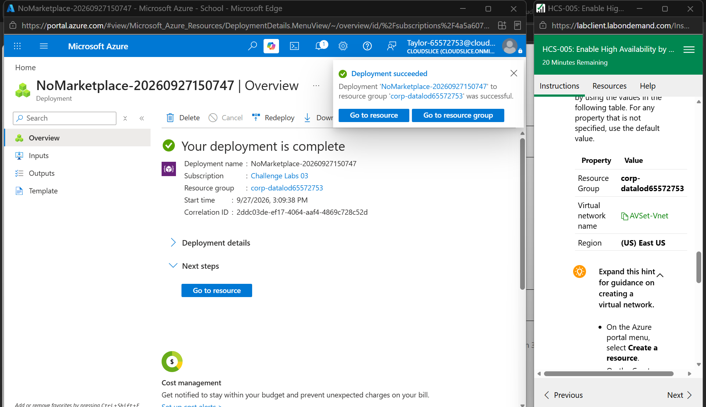
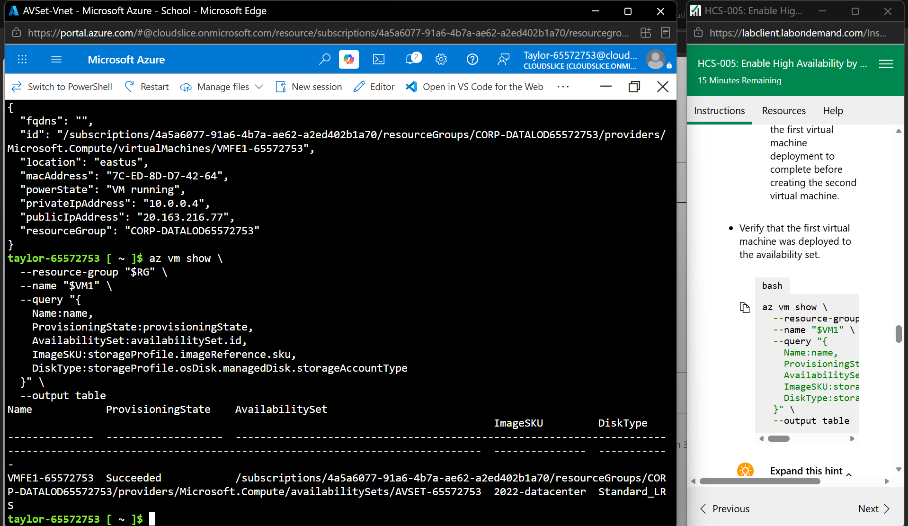
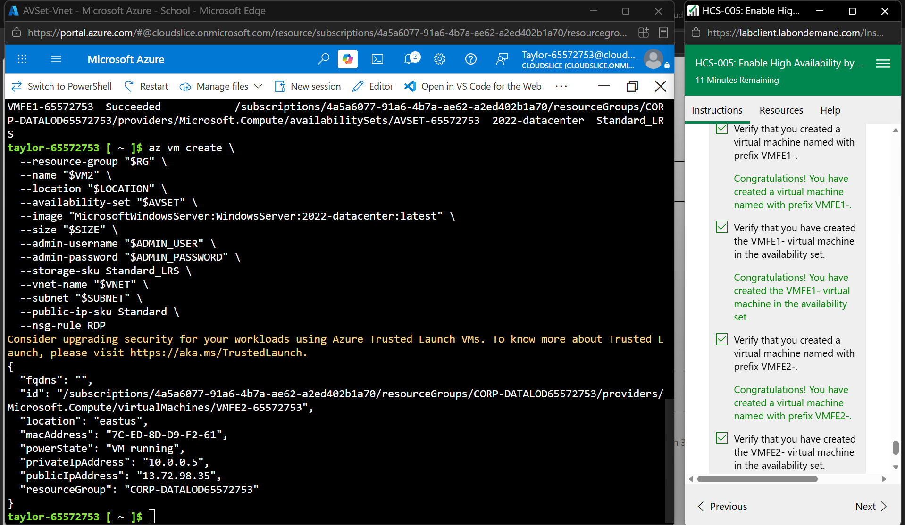
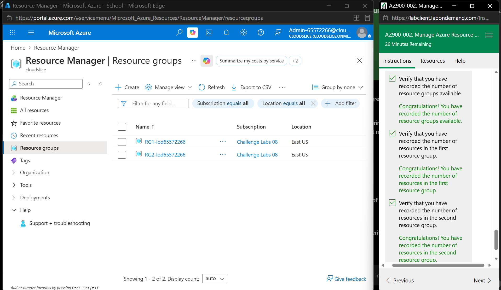
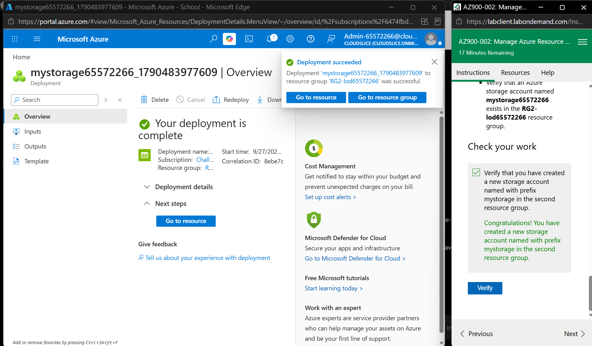
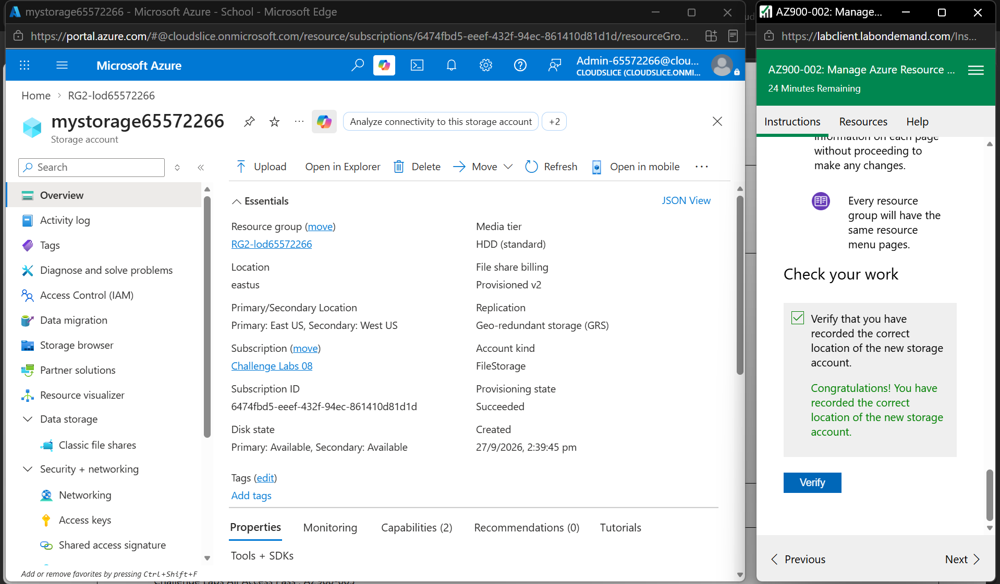
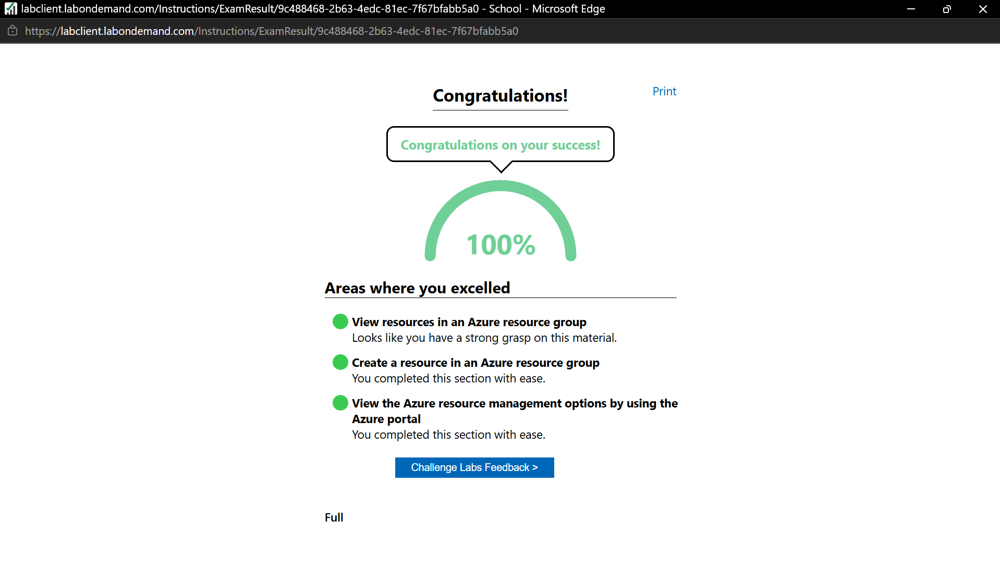

# Week 9 – High Availability and Virtual Machine Scale Sets

## Portfolio Task 1 – High Availability Using Availability Sets

In this task, I configured high availability in Microsoft Azure using an Availability Set. I created an availability set and a virtual network, deployed two Azure virtual machines into the availability set, and then configured an Azure Load Balancer.

The purpose of an Availability Set is to improve the availability of virtual machines by distributing them across fault domains and update domains. This reduces the possibility that all virtual machines become unavailable at the same time because of hardware failure or planned maintenance.

### Availability Set and Virtual Network

I created an Azure Availability Set and the `AVSet-Vnet` virtual network. The virtual network provides network connectivity for the virtual machines used in the high-availability configuration.

*Figure 1: Successful deployment of the virtual network for the high-availability environment.*

### Virtual Machines in the Availability Set

I deployed two Windows Server virtual machines into the same availability set. I verified that the virtual machines were successfully provisioned and associated with the availability set.

*Figure 2: Verification of the virtual machine deployed in the Azure Availability Set.*

*Figure 3: Two virtual machines successfully deployed and verified in the Availability Set.*

### Azure Load Balancer

I configured an Azure Load Balancer for the two virtual machines. The configuration included a frontend public IP address, backend pool, health probe and load-balancing rule.

The backend pool contained both virtual machines. The health probe used TCP port 80 to check whether the backend instances were available. The load-balancing rule was also configured for TCP port 80 so incoming traffic could be distributed between the available virtual machines.

*Figure 4: Successful completion of the high-availability lab, including the Availability Set, virtual machines and Azure Load Balancer.*

### What I Learned

From this task, I learned how Azure Availability Sets can improve virtual machine availability. I also learned how multiple virtual machines can be placed in an availability set and connected to an Azure Load Balancer. The load balancer can distribute incoming traffic between backend virtual machines, while health probes are used to identify whether the backend machines are available.

---

## Portfolio Task 2 – Azure Resource Management

In this task, I worked with Azure resource groups and resource management in the Azure Portal. I viewed the available resource groups, checked the resources inside them, created a new Azure storage account, and reviewed its configuration.

### Resource Groups

I viewed the Azure resource groups and checked the resources available inside each group. This helped me understand how Azure uses resource groups to organise and manage related cloud resources.

*Figure 1: Viewing and verifying Azure resource groups in the Azure Portal.*

### Creating a Storage Account

I created a new Azure storage account inside the second resource group. The deployment completed successfully, confirming that the storage resource was created in the selected resource group.

*Figure 2: Successful deployment of a new Azure storage account.*

### Storage Account Configuration

I opened the created storage account and reviewed its configuration and resource information. The storage account showed a successful provisioning state and its Azure region, resource group, subscription and replication information.

*Figure 3: Reviewing the successfully created Azure storage account and its configuration.*

### Task Completion

The guided activity was successfully completed with a score of 100%. The activity included viewing resources in Azure resource groups, creating a resource in a resource group, and exploring Azure resource management options through the Azure Portal.

*Figure 4: Successful completion of the Azure Resource Management activity with 100%.*

### What I Learned

From this task, I learned how Azure resource groups are used to organise and manage cloud resources. I also learned how to view resources inside a resource group, create a new resource in a selected resource group, and review resource configuration through the Azure Portal. Creating the storage account also helped me understand how Azure resources are associated with a resource group, subscription and deployment region.
