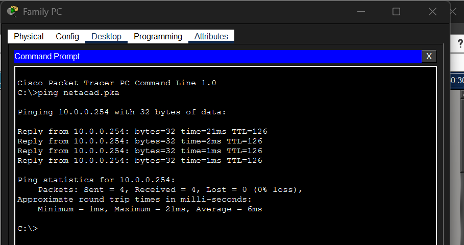
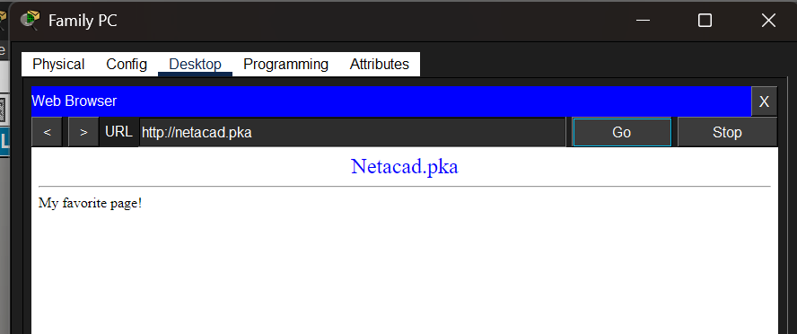
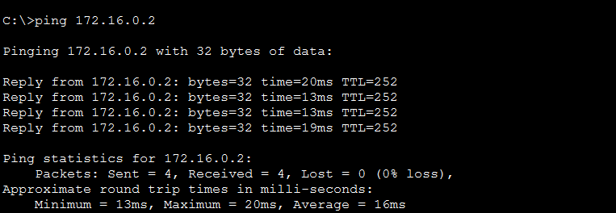
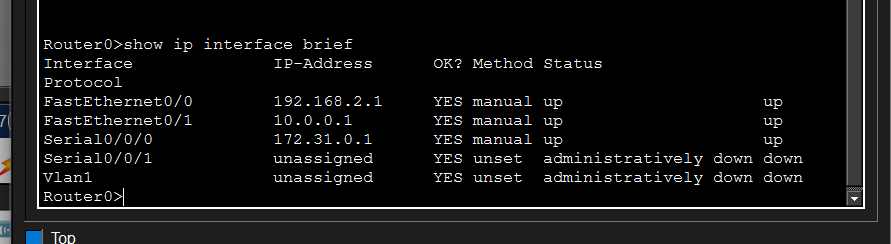

# Week 10 – Connecting a Wired and Wireless LAN

## Overview

In Week 10, I worked with Cisco Packet Tracer to examine a network containing both wired and wireless connections. The activity focused on understanding how different network devices are connected, verifying communication between devices, accessing a router through a console connection, and examining the network in the Physical Workspace.

The main devices in the topology included routers, a switch, a cloud, a cable modem, a wireless router, PCs, a server and a configuration terminal.

---

## Part 4 – Verify Connections

### Step 1 – Test the Connection from Family PC to netacad.pka

I opened the Command Prompt on the Family PC and tested connectivity to `netacad.pka` using:

`ping netacad.pka`

The hostname resolved to `10.0.0.254`. All four ping packets were successfully received with 0% packet loss. This confirmed that the Family PC could communicate with the netacad.pka server.

**Figure 1: Successful ping from Family PC to netacad.pka.**

I then opened the Web Browser on the Family PC and entered:

`http://netacad.pka`

The Netacad.pka webpage loaded successfully, confirming HTTP connectivity between the Family PC and the server.

**Figure 2: Successful access to the netacad.pka webpage from Family PC.**

---

### Step 2 – Ping the Switch from Home PC

I opened the Command Prompt on the Home PC and pinged the switch using its IP address:

`ping 172.16.0.2`

The test returned four successful replies with 0% packet loss. This confirmed connectivity between the Home PC and the switch.

**Figure 3: Successful ping from Home PC to the switch.**

---

### Step 3 – Access Router0 from the Configuration Terminal

I opened the Terminal application on the Configuration Terminal and used the default terminal settings to access Router0 through the console connection.

I then entered:

`show ip interface brief`

The output showed the status and IP addressing of the Router0 interfaces. The main configured interfaces were:

- FastEthernet0/0 – `192.168.2.1` – up/up
- FastEthernet0/1 – `10.0.0.1` – up/up
- Serial0/0/0 – `172.31.0.1` – up/up

This confirmed that the main Router0 interfaces used by the topology were operational.

**Figure 4: Router0 interface status using the `show ip interface brief` command.**

---

## Part 5 – Examine the Physical Topology

### Step 1(c) – Examine the Cloud

**Question: How many wires are connected to the switch in the blue rack?**

**Answer:**  
When I opened the Cloud in the Physical Workspace, I observed the switch inside the blue rack. I could see **two wires connected to the switch**.

---

### Step 2(a) – Examine the Primary Network

**Question: What is located on the table to the right of the blue rack?**

**Answer:**  
When I opened the Primary Network and looked around the physical workspace, I observed the equipment placed on the table to the right of the blue rack.  
**[Add the exact device/equipment you observe here.]**

---

### Step 3(a) – Examine the Secondary Network

**Question: Why are there two orange cables connected to each device?**

**Answer:**  
In the Secondary Network, I noticed that each device had two orange cables connected. From the physical view, these provide **two separate connections between the devices**, instead of relying on only one connection.

---

### Step 4(a) – Examine the Home Network

**Question: Why is there an oval mesh covering the home network?**

**Answer:**  
I observed an oval-shaped mesh around the Home Network. This represents the **wireless coverage area** of the wireless router, showing that wireless devices within this area can connect to the network without a physical cable.

---

### Step 4(b) – Examine the Home Network

**Question: Why is there no rack to hold the equipment?**

**Answer:**  
When I opened the Home Network, I noticed that the devices were not installed in a rack. This is because it represents a **normal home network**, where devices such as the wireless router, computer and printer are usually placed around the home rather than installed in a network rack.

## Week 10 Reflection

This activity helped me understand how wired and wireless devices are connected in a network and how connectivity can be verified using different methods. I used ping to test communication between devices, accessed a web server through a browser, and used a console terminal to check Router0 interface information. The Physical Workspace also helped me understand how the logical network topology relates to the physical placement of network equipment.
